Mas# 📊 Sistema de Gestão Financeira - Documentação Completa

## 📋 Índice

1. [Visão Geral do Sistema](#visão-geral-do-sistema)
2. [Arquitetura](#arquitetura)
3. [Tecnologias Utilizadas](#tecnologias-utilizadas)
4. [Modelo de Dados](#modelo-de-dados)
5. [Pipeline de Importação CSV](#pipeline-de-importação-csv)
6. [API Backend](#api-backend)
7. [Interface Frontend](#interface-frontend)
8. [Funcionalidades Principais](#funcionalidades-principais)
9. [Fluxos de Negócio](#fluxos-de-negócio)
10. [Estatísticas e KPIs Avançados](#estatísticas-e-kpis-avançados)
11. [Considerações de Performance e Segurança](#considerações-de-performance-e-segurança)
12. [Limitações e Melhorias Futuras](#limitações-e-melhorias-futuras)
13. [Configuração e Deploy](#configuração-e-deploy)

---

## 🎯 Visão Geral do Sistema

O **Sistema de Gestão Financeira** é uma aplicação web completa desenvolvida para gerenciar clientes, contratos e pagamentos de forma integrada e eficiente. O sistema oferece uma interface moderna e intuitiva para controle financeiro empresarial, inspirada nos melhores padrões de design de aplicações como Stripe Dashboard, Linear, Notion e Figma.

### Objetivos Principais
- Centralizar o gerenciamento de clientes e contratos
- Automatizar o controle de pagamentos e parcelas
- Fornecer insights financeiros através de dashboards interativos
- Facilitar a importação massiva de dados via CSV
- Garantir rastreabilidade completa das operações financeiras
- Oferecer análises avançadas de performance e inadimplência

### Problemas que Resolve
- **Dispersão de dados**: Centraliza informações financeiras em uma única plataforma
- **Controle manual de pagamentos**: Automatiza o acompanhamento de parcelas e vencimentos
- **Falta de visibilidade**: Oferece dashboards com métricas em tempo real
- **Importação complexa**: Simplifica a migração de dados legados via CSV
- **Análise limitada**: Fornece KPIs avançados e análises de cohort

### Público-Alvo
- **Gestores Financeiros**: Controle completo de recebíveis e inadimplência
- **Administradores**: Visão estratégica através de dashboards executivos
- **Operadores**: Interface intuitiva para cadastro e acompanhamento diário
- **Analistas**: Ferramentas avançadas para análise de performance

### Inspirações de Design
- **Stripe Dashboard**: Interface limpa e métricas bem organizadas
- **Linear**: Navegação fluida e componentes modernos
- **Notion**: Flexibilidade na organização de informações
- **Figma**: Design system consistente e componentes reutilizáveis

### Diferenciais Competitivos
- **Pipeline de Importação Inteligente**: Processamento automático de CSV com normalização de dados
- **Análises Avançadas**: LTV, cohort analysis e projeções de fluxo de caixa
- **Interface Responsiva**: Desenvolvida em Flutter para máxima performance
- **Arquitetura Escalável**: Backend Node.js com Supabase para alta disponibilidade
- **Tratamento de Duplicidades**: Sistema inteligente de mapeamento e normalização

---

## 🏗️ Arquitetura

O sistema adota uma **arquitetura de três camadas** (3-tier architecture) com separação clara de responsabilidades, garantindo escalabilidade, manutenibilidade e performance otimizada.

### Visão Geral da Arquitetura

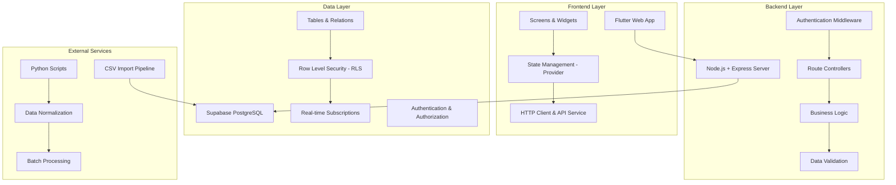

### Justificativas Técnicas das Escolhas

#### Frontend - Flutter Web
**Por que Flutter?**
- **Performance Superior**: Compilação para JavaScript otimizado
- **Desenvolvimento Unificado**: Mesmo código para web, mobile e desktop
- **UI Consistente**: Widgets nativos garantem experiência uniforme
- **Hot Reload**: Desenvolvimento ágil com atualizações instantâneas
- **Ecosystem Maduro**: Ampla biblioteca de packages e plugins

**Alternativas Consideradas:**
- React.js: Descartado pela necessidade de manter consistência com futuras versões mobile
- Vue.js: Menor ecosystem comparado ao Flutter
- Angular: Complexidade excessiva para o escopo do projeto

#### Backend - Node.js + Express
**Por que Node.js?**
- **Performance Assíncrona**: Event loop ideal para operações I/O intensivas
- **Ecosystem Rico**: NPM com milhões de packages disponíveis
- **Desenvolvimento Rápido**: JavaScript full-stack reduz context switching
- **Escalabilidade Horizontal**: Fácil distribuição em múltiplas instâncias
- **Comunidade Ativa**: Suporte contínuo e atualizações frequentes

**Por que Express?**
- **Minimalista e Flexível**: Framework não-opinativo permite customização total
- **Middleware Ecosystem**: Vasta gama de middlewares para funcionalidades específicas
- **Performance Comprovada**: Usado por empresas como Netflix, Uber e WhatsApp
- **Documentação Excelente**: Curva de aprendizado suave

#### Database - Supabase (PostgreSQL)
**Por que Supabase?**
- **PostgreSQL Gerenciado**: Robustez do PostgreSQL sem overhead de administração
- **Real-time Subscriptions**: Atualizações em tempo real via WebSockets
- **Row Level Security (RLS)**: Segurança granular a nível de linha
- **API REST Automática**: Endpoints gerados automaticamente das tabelas
- **Authentication Built-in**: Sistema de autenticação completo integrado
- **Backup Automático**: Backups incrementais e point-in-time recovery

**Alternativas Consideradas:**
- Firebase: Limitações do NoSQL para queries complexas
- AWS RDS: Maior complexidade de configuração e custos
- MongoDB: Falta de ACID transactions para operações financeiras críticas

### Padrões Arquiteturais Implementados

#### 1. Repository Pattern
- **Localização**: `lib/services/api_service.dart`
- **Benefício**: Abstração da camada de dados, facilitando testes e manutenção
- **Implementação**: Métodos específicos para cada entidade (clients, contracts, payments)

#### 2. Provider Pattern (State Management)
- **Localização**: `lib/providers/`
- **Benefício**: Gerenciamento de estado reativo e eficiente
- **Implementação**: Providers específicos para dashboard, clientes, contratos e pagamentos

#### 3. Middleware Pattern
- **Localização**: `backend/src/middleware/`
- **Benefício**: Separação de concerns para autenticação, validação e logging
- **Implementação**: Middleware para auth, CORS, rate limiting e validação

#### 4. MVC Pattern
- **Model**: Definições de dados em `lib/models/`
- **View**: Screens e widgets em `lib/screens/` e `lib/widgets/`
- **Controller**: Route handlers em `backend/src/routes/`

### Fluxo de Dados

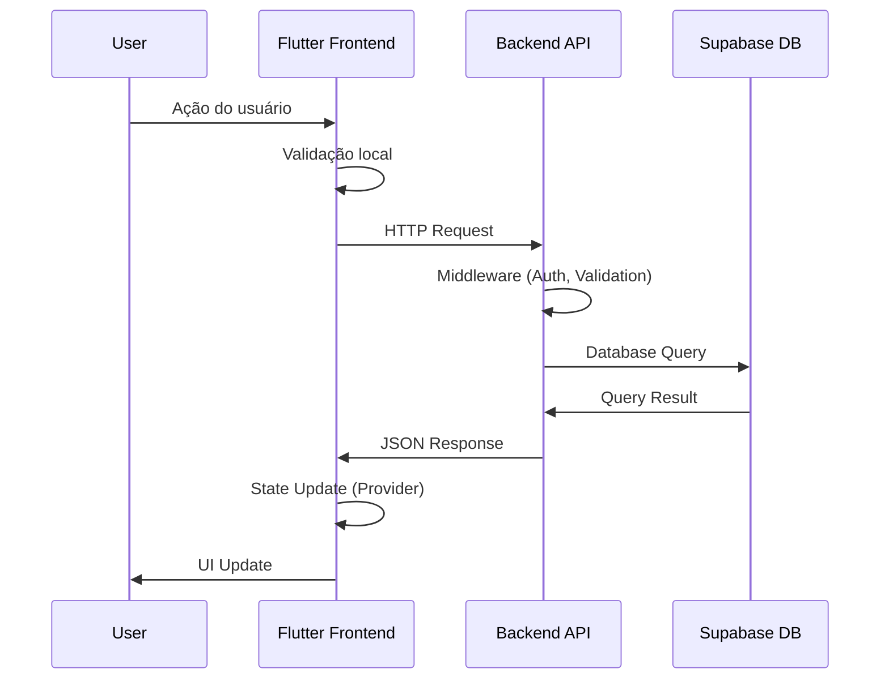

### Escalabilidade e Performance

#### Estratégias de Escalabilidade
1. **Horizontal Scaling**: Backend stateless permite múltiplas instâncias
2. **Database Sharding**: Preparado para particionamento por tenant
3. **CDN Integration**: Assets estáticos servidos via CDN
4. **Caching Strategy**: Redis para cache de queries frequentes (futuro)

#### Otimizações de Performance
1. **Lazy Loading**: Carregamento sob demanda de dados
2. **Pagination**: Limitação de resultados para queries grandes
3. **Database Indexing**: Índices otimizados para queries frequentes
4. **Connection Pooling**: Pool de conexões para eficiência de database

### Arquitetura Geral
```
┌─────────────────┐    ┌─────────────────┐    ┌─────────────────┐
│   Flutter Web   │    │   Node.js API   │    │   Supabase DB   │
│   (Frontend)    │◄──►│   (Backend)     │◄──►│   (PostgreSQL)  │
└─────────────────┘    └─────────────────┘    └─────────────────┘
```

### Padrões Arquiteturais:
- **Frontend**: Provider Pattern para gerenciamento de estado
- **Backend**: RESTful API com Express.js
- **Database**: PostgreSQL com Supabase como BaaS
- **Autenticação**: JWT tokens via Supabase Auth

---

## 💻 Tecnologias Utilizadas

### Backend (Node.js)
```json
{
  "runtime": "Node.js",
  "framework": "Express.js",
  "database": "Supabase (PostgreSQL)",
  "authentication": "Supabase Auth",
  "dependencies": {
    "express": "^4.18.2",
    "@supabase/supabase-js": "^2.39.0",
    "bcryptjs": "^2.4.3",
    "cors": "^2.8.5",
    "helmet": "^7.1.0",
    "morgan": "^1.10.0",
    "compression": "^1.7.4",
    "express-rate-limit": "^7.1.5",
    "joi": "^17.11.0"
  }
}
```

### Frontend (Flutter)
```yaml
dependencies:
  flutter: sdk
  supabase_flutter: ^2.0.0
  http: ^1.1.0
  provider: ^6.1.1
  intl: ^0.19.0
```

### Infraestrutura
- **Banco de Dados**: Supabase PostgreSQL
- **Autenticação**: Supabase Auth
- **API**: RESTful com Express.js
- **Frontend**: Flutter Web
- **Deploy**: Supabase Hosting

---

## 📊 Modelo de Dados

O sistema utiliza um modelo relacional robusto baseado em PostgreSQL, com foco em integridade referencial, auditoria completa e performance otimizada.

### Diagrama Entidade-Relacionamento (ERD)

```mermaid
erDiagram
    COMPANIES {
        uuid id PK
        varchar name
        varchar document
        varchar email
        varchar phone
        text address
        varchar city
        varchar state
        varchar zip_code
        boolean is_active
        timestamp created_at
        timestamp updated_at
    }
    
    BRANCHES {
        uuid id PK
        uuid company_id FK
        varchar name
        varchar code
        text address
        varchar city
        varchar state
        varchar zip_code
        varchar phone
        varchar email
        varchar manager_name
        boolean is_active
        timestamp created_at
        timestamp updated_at
    }
    
    USERS {
        uuid id PK
        uuid auth_user_id
        uuid company_id FK
        uuid branch_id FK
        varchar name
        varchar email
        varchar phone
        varchar role
        jsonb permissions
        boolean is_active
        timestamp last_login
        timestamp created_at
        timestamp updated_at
    }
    
    CLIENTS {
        uuid id PK
        uuid company_id FK
        uuid branch_id FK
        varchar name
        varchar document
        varchar document_type
        varchar email
        varchar phone
        varchar mobile
        date birth_date
        text address
        varchar neighborhood
        varchar city
        varchar state
        varchar zip_code
        varchar occupation
        decimal monthly_income
        varchar marital_status
        varchar spouse_name
        varchar spouse_document
        varchar spouse_phone
        varchar reference_name
        varchar reference_phone
        varchar reference_relationship
        text notes
        boolean is_active
        timestamp created_at
        timestamp updated_at
    }
    
    CONTRACTS {
        uuid id PK
        uuid company_id FK
        uuid branch_id FK
        uuid client_id FK
        varchar contract_number
        text product_description
        decimal total_amount
        decimal down_payment
        decimal financed_amount
        integer installments
        decimal installment_amount
        decimal interest_rate
        date start_date
        date first_due_date
        varchar status
        varchar payment_method
        text notes
        uuid created_by FK
        timestamp created_at
        timestamp updated_at
    }
    
    PAYMENTS {
        uuid id PK
        uuid company_id FK
        uuid branch_id FK
        uuid contract_id FK
        uuid client_id FK
        integer installment_number
        date due_date
        decimal amount
        decimal paid_amount
        date payment_date
        varchar payment_method
        varchar status
        decimal late_fee
        decimal discount
        text notes
        varchar receipt_number
        timestamp created_at
        timestamp updated_at
    }
    
    CONTRACT_DOCUMENTS {
        uuid id PK
        uuid contract_id FK
        varchar document_name
        varchar document_type
        varchar file_path
        integer file_size
        varchar mime_type
        uuid uploaded_by FK
        timestamp created_at
    }
    
    PREDEFINED_NOTES {
        uuid id PK
        uuid company_id FK
        varchar category
        varchar title
        text content
        boolean is_active
        timestamp created_at
        timestamp updated_at
    }
    
    AUDIT_LOGS {
        uuid id PK
        uuid company_id FK
        uuid user_id FK
        varchar table_name
        uuid record_id
        varchar action
        jsonb old_values
        jsonb new_values
        timestamp created_at
    }

    COMPANIES ||--o{ BRANCHES : "has"
    COMPANIES ||--o{ USERS : "employs"
    COMPANIES ||--o{ CLIENTS : "serves"
    COMPANIES ||--o{ CONTRACTS : "manages"
    COMPANIES ||--o{ PAYMENTS : "processes"
    COMPANIES ||--o{ PREDEFINED_NOTES : "defines"
    COMPANIES ||--o{ AUDIT_LOGS : "tracks"
    
    BRANCHES ||--o{ USERS : "assigns"
    BRANCHES ||--o{ CLIENTS : "serves"
    BRANCHES ||--o{ CONTRACTS : "handles"
    BRANCHES ||--o{ PAYMENTS : "processes"
    
    USERS ||--o{ CONTRACTS : "creates"
    USERS ||--o{ CONTRACT_DOCUMENTS : "uploads"
    USERS ||--o{ AUDIT_LOGS : "performs"
    
    CLIENTS ||--o{ CONTRACTS : "signs"
    CLIENTS ||--o{ PAYMENTS : "owes"
    
    CONTRACTS ||--o{ PAYMENTS : "generates"
    CONTRACTS ||--o{ CONTRACT_DOCUMENTS : "contains"
```

### Dicionário de Dados Completo

#### 1. COMPANIES (Empresas)
| Campo | Tipo | Constraints | Descrição |
|-------|------|-------------|-----------|
| `id` | UUID | PK, DEFAULT uuid_generate_v4() | Identificador único da empresa |
| `name` | VARCHAR(255) | NOT NULL | Nome da empresa |
| `document` | VARCHAR(20) | UNIQUE, NOT NULL | CNPJ da empresa |
| `email` | VARCHAR(255) | - | Email principal da empresa |
| `phone` | VARCHAR(20) | - | Telefone principal |
| `address` | TEXT | - | Endereço completo |
| `city` | VARCHAR(100) | - | Cidade |
| `state` | VARCHAR(2) | - | Estado (UF) |
| `zip_code` | VARCHAR(10) | - | CEP |
| `is_active` | BOOLEAN | DEFAULT true | Status ativo/inativo |
| `created_at` | TIMESTAMP WITH TIME ZONE | DEFAULT NOW() | Data de criação |
| `updated_at` | TIMESTAMP WITH TIME ZONE | DEFAULT NOW() | Data da última atualização |

#### 2. BRANCHES (Filiais)
| Campo | Tipo | Constraints | Descrição |
|-------|------|-------------|-----------|
| `id` | UUID | PK, DEFAULT uuid_generate_v4() | Identificador único da filial |
| `company_id` | UUID | FK → companies(id), NOT NULL, CASCADE DELETE | Empresa proprietária |
| `name` | VARCHAR(255) | NOT NULL | Nome da filial |
| `code` | VARCHAR(10) | UNIQUE, NOT NULL | Código identificador da filial |
| `address` | TEXT | - | Endereço da filial |
| `city` | VARCHAR(100) | - | Cidade |
| `state` | VARCHAR(2) | - | Estado (UF) |
| `zip_code` | VARCHAR(10) | - | CEP |
| `phone` | VARCHAR(20) | - | Telefone da filial |
| `email` | VARCHAR(255) | - | Email da filial |
| `manager_name` | VARCHAR(255) | - | Nome do gerente |
| `is_active` | BOOLEAN | DEFAULT true | Status ativo/inativo |
| `created_at` | TIMESTAMP WITH TIME ZONE | DEFAULT NOW() | Data de criação |
| `updated_at` | TIMESTAMP WITH TIME ZONE | DEFAULT NOW() | Data da última atualização |

#### 3. USERS (Usuários)
| Campo | Tipo | Constraints | Descrição |
|-------|------|-------------|-----------|
| `id` | UUID | PK, DEFAULT uuid_generate_v4() | Identificador único do usuário |
| `auth_user_id` | UUID | UNIQUE | Referência ao auth.users do Supabase |
| `company_id` | UUID | FK → companies(id), NOT NULL, CASCADE DELETE | Empresa do usuário |
| `branch_id` | UUID | FK → branches(id), SET NULL | Filial do usuário |
| `name` | VARCHAR(255) | NOT NULL | Nome completo |
| `email` | VARCHAR(255) | UNIQUE, NOT NULL | Email único |
| `phone` | VARCHAR(20) | - | Telefone |
| `role` | VARCHAR(50) | NOT NULL, DEFAULT 'user', CHECK IN ('admin', 'manager', 'user', 'viewer') | Papel do usuário |
| `permissions` | JSONB | DEFAULT '{}' | Permissões específicas |
| `is_active` | BOOLEAN | DEFAULT true | Status ativo/inativo |
| `last_login` | TIMESTAMP WITH TIME ZONE | - | Último login |
| `created_at` | TIMESTAMP WITH TIME ZONE | DEFAULT NOW() | Data de criação |
| `updated_at` | TIMESTAMP WITH TIME ZONE | DEFAULT NOW() | Data da última atualização |

#### 4. CLIENTS (Clientes)
| Campo | Tipo | Constraints | Descrição |
|-------|------|-------------|-----------|
| `id` | UUID | PK, DEFAULT uuid_generate_v4() | Identificador único do cliente |
| `company_id` | UUID | FK → companies(id), NOT NULL, CASCADE DELETE | Empresa proprietária |
| `branch_id` | UUID | FK → branches(id), NOT NULL, CASCADE DELETE | Filial responsável |
| `name` | VARCHAR(255) | NOT NULL | Nome completo |
| `document` | VARCHAR(20) | NOT NULL | CPF/CNPJ |
| `document_type` | VARCHAR(10) | NOT NULL, DEFAULT 'CPF', CHECK IN ('CPF', 'CNPJ') | Tipo do documento |
| `email` | VARCHAR(255) | - | Email do cliente |
| `phone` | VARCHAR(20) | - | Telefone fixo |
| `mobile` | VARCHAR(20) | - | Telefone celular |
| `birth_date` | DATE | - | Data de nascimento |
| `address` | TEXT | - | Endereço completo |
| `neighborhood` | VARCHAR(100) | - | Bairro |
| `city` | VARCHAR(100) | - | Cidade |
| `state` | VARCHAR(2) | - | Estado (UF) |
| `zip_code` | VARCHAR(10) | - | CEP |
| `occupation` | VARCHAR(100) | - | Profissão |
| `monthly_income` | DECIMAL(15,2) | - | Renda mensal |
| `marital_status` | VARCHAR(20) | CHECK IN ('solteiro', 'casado', 'divorciado', 'viuvo', 'uniao_estavel') | Estado civil |
| `spouse_name` | VARCHAR(255) | - | Nome do cônjuge |
| `spouse_document` | VARCHAR(20) | - | CPF do cônjuge |
| `spouse_phone` | VARCHAR(20) | - | Telefone do cônjuge |
| `reference_name` | VARCHAR(255) | - | Nome da referência |
| `reference_phone` | VARCHAR(20) | - | Telefone da referência |
| `reference_relationship` | VARCHAR(100) | - | Relacionamento com a referência |
| `notes` | TEXT | - | Observações |
| `is_active` | BOOLEAN | DEFAULT true | Status ativo/inativo |
| `created_at` | TIMESTAMP WITH TIME ZONE | DEFAULT NOW() | Data de criação |
| `updated_at` | TIMESTAMP WITH TIME ZONE | DEFAULT NOW() | Data da última atualização |

**Constraints Únicos:**
- `UNIQUE(company_id, document)` - Documento único por empresa

#### 5. CONTRACTS (Contratos)
| Campo | Tipo | Constraints | Descrição |
|-------|------|-------------|-----------|
| `id` | UUID | PK, DEFAULT uuid_generate_v4() | Identificador único do contrato |
| `company_id` | UUID | FK → companies(id), NOT NULL, CASCADE DELETE | Empresa proprietária |
| `branch_id` | UUID | FK → branches(id), NOT NULL, CASCADE DELETE | Filial responsável |
| `client_id` | UUID | FK → clients(id), NOT NULL, CASCADE DELETE | Cliente contratante |
| `contract_number` | VARCHAR(50) | NOT NULL | Número do contrato |
| `product_description` | TEXT | NOT NULL | Descrição do produto/serviço |
| `total_amount` | DECIMAL(15,2) | NOT NULL, CHECK > 0 | Valor total do contrato |
| `down_payment` | DECIMAL(15,2) | NOT NULL, DEFAULT 0 | Valor da entrada |
| `financed_amount` | DECIMAL(15,2) | NOT NULL, CHECK > 0 | Valor financiado |
| `installments` | INTEGER | NOT NULL, CHECK > 0 | Número de parcelas |
| `installment_amount` | DECIMAL(15,2) | NOT NULL, CHECK > 0 | Valor da parcela |
| `interest_rate` | DECIMAL(5,4) | DEFAULT 0 | Taxa de juros (decimal) |
| `start_date` | DATE | NOT NULL | Data de início |
| `first_due_date` | DATE | NOT NULL | Data do primeiro vencimento |
| `status` | VARCHAR(20) | NOT NULL, DEFAULT 'active', CHECK IN ('active', 'completed', 'cancelled', 'suspended') | Status do contrato |
| `payment_method` | VARCHAR(20) | NOT NULL, DEFAULT 'boleto', CHECK IN ('boleto', 'cartao', 'dinheiro', 'pix', 'transferencia') | Método de pagamento |
| `notes` | TEXT | - | Observações |
| `created_by` | UUID | FK → users(id) | Usuário criador |
| `created_at` | TIMESTAMP WITH TIME ZONE | DEFAULT NOW() | Data de criação |
| `updated_at` | TIMESTAMP WITH TIME ZONE | DEFAULT NOW() | Data da última atualização |

**Constraints Únicos:**
- `UNIQUE(company_id, contract_number)` - Número único por empresa

**Constraints de Validação:**
- `positive_amounts` - Valores positivos para total_amount, financed_amount, installment_amount
- `valid_installments` - Número de parcelas > 0

#### 6. PAYMENTS (Pagamentos)
| Campo | Tipo | Constraints | Descrição |
|-------|------|-------------|-----------|
| `id` | UUID | PK, DEFAULT uuid_generate_v4() | Identificador único do pagamento |
| `company_id` | UUID | FK → companies(id), NOT NULL, CASCADE DELETE | Empresa proprietária |
| `branch_id` | UUID | FK → branches(id), NOT NULL, CASCADE DELETE | Filial responsável |
| `contract_id` | UUID | FK → contracts(id), NOT NULL, CASCADE DELETE | Contrato relacionado |
| `client_id` | UUID | FK → clients(id), NOT NULL, CASCADE DELETE | Cliente pagador |
| `installment_number` | INTEGER | NOT NULL | Número da parcela |
| `due_date` | DATE | NOT NULL | Data de vencimento |
| `amount` | DECIMAL(15,2) | NOT NULL, CHECK > 0 | Valor da parcela |
| `paid_amount` | DECIMAL(15,2) | DEFAULT 0, CHECK >= 0 | Valor pago |
| `payment_date` | DATE | - | Data do pagamento |
| `payment_method` | VARCHAR(20) | CHECK IN ('boleto', 'cartao', 'dinheiro', 'pix', 'transferencia') OR NULL | Método usado no pagamento |
| `status` | VARCHAR(20) | NOT NULL, DEFAULT 'pending', CHECK IN ('pending', 'paid', 'overdue', 'cancelled') | Status do pagamento |
| `late_fee` | DECIMAL(15,2) | DEFAULT 0 | Multa por atraso |
| `discount` | DECIMAL(15,2) | DEFAULT 0 | Desconto aplicado |
| `notes` | TEXT | - | Observações |
| `receipt_number` | VARCHAR(100) | - | Número do comprovante |
| `created_at` | TIMESTAMP WITH TIME ZONE | DEFAULT NOW() | Data de criação |
| `updated_at` | TIMESTAMP WITH TIME ZONE | DEFAULT NOW() | Data da última atualização |

**Constraints Únicos:**
- `UNIQUE(contract_id, installment_number)` - Parcela única por contrato

**Constraints de Validação:**
- `positive_payment_amounts` - Valor > 0 e valor pago >= 0

#### 7. CONTRACT_DOCUMENTS (Documentos de Contratos)
| Campo | Tipo | Constraints | Descrição |
|-------|------|-------------|-----------|
| `id` | UUID | PK, DEFAULT uuid_generate_v4() | Identificador único do documento |
| `contract_id` | UUID | FK → contracts(id), NOT NULL, CASCADE DELETE | Contrato relacionado |
| `document_name` | VARCHAR(255) | NOT NULL | Nome do documento |
| `document_type` | VARCHAR(50) | NOT NULL, CHECK IN ('contract', 'identity', 'proof_income', 'proof_residence', 'other') | Tipo do documento |
| `file_path` | VARCHAR(500) | NOT NULL | Caminho do arquivo |
| `file_size` | INTEGER | - | Tamanho em bytes |
| `mime_type` | VARCHAR(100) | - | Tipo MIME |
| `uploaded_by` | UUID | FK → users(id) | Usuário que fez upload |
| `created_at` | TIMESTAMP WITH TIME ZONE | DEFAULT NOW() | Data de upload |

#### 8. PREDEFINED_NOTES (Notas Predefinidas)
| Campo | Tipo | Constraints | Descrição |
|-------|------|-------------|-----------|
| `id` | UUID | PK, DEFAULT uuid_generate_v4() | Identificador único da nota |
| `company_id` | UUID | FK → companies(id), NOT NULL, CASCADE DELETE | Empresa proprietária |
| `category` | VARCHAR(50) | NOT NULL, CHECK IN ('client', 'contract', 'payment', 'general') | Categoria da nota |
| `title` | VARCHAR(255) | NOT NULL | Título da nota |
| `content` | TEXT | NOT NULL | Conteúdo da nota |
| `is_active` | BOOLEAN | DEFAULT true | Status ativo/inativo |
| `created_at` | TIMESTAMP WITH TIME ZONE | DEFAULT NOW() | Data de criação |
| `updated_at` | TIMESTAMP WITH TIME ZONE | DEFAULT NOW() | Data da última atualização |

#### 9. AUDIT_LOGS (Logs de Auditoria)
| Campo | Tipo | Constraints | Descrição |
|-------|------|-------------|-----------|
| `id` | UUID | PK, DEFAULT uuid_generate_v4() | Identificador único do log |
| `company_id` | UUID | FK → companies(id), NOT NULL, CASCADE DELETE | Empresa relacionada |
| `user_id` | UUID | FK → users(id), SET NULL | Usuário que executou a ação |
| `table_name` | VARCHAR(100) | NOT NULL | Nome da tabela afetada |
| `record_id` | UUID | NOT NULL | ID do registro afetado |
| `action` | VARCHAR(20) | NOT NULL, CHECK IN ('INSERT', 'UPDATE', 'DELETE') | Tipo de ação |
| `old_values` | JSONB | - | Valores anteriores (UPDATE/DELETE) |
| `new_values` | JSONB | - | Novos valores (INSERT/UPDATE) |
| `created_at` | TIMESTAMP WITH TIME ZONE | DEFAULT NOW() | Data da ação |

### Índices de Performance

#### Índices Principais
```sql
-- Branches
CREATE INDEX idx_branches_company_id ON branches(company_id);

-- Users
CREATE INDEX idx_users_company_id ON users(company_id);
CREATE INDEX idx_users_branch_id ON users(branch_id);
CREATE INDEX idx_users_auth_user_id ON users(auth_user_id);

-- Clients
CREATE INDEX idx_clients_company_id ON clients(company_id);
CREATE INDEX idx_clients_branch_id ON clients(branch_id);
CREATE INDEX idx_clients_document ON clients(document);

-- Contracts
CREATE INDEX idx_contracts_company_id ON contracts(company_id);
CREATE INDEX idx_contracts_branch_id ON contracts(branch_id);
CREATE INDEX idx_contracts_client_id ON contracts(client_id);
CREATE INDEX idx_contracts_status ON contracts(status);
CREATE INDEX idx_contracts_start_date ON contracts(start_date);

-- Payments
CREATE INDEX idx_payments_company_id ON payments(company_id);
CREATE INDEX idx_payments_branch_id ON payments(branch_id);
CREATE INDEX idx_payments_contract_id ON payments(contract_id);
CREATE INDEX idx_payments_client_id ON payments(client_id);
CREATE INDEX idx_payments_status ON payments(status);
CREATE INDEX idx_payments_due_date ON payments(due_date);

-- Contract Documents
CREATE INDEX idx_contract_documents_contract_id ON contract_documents(contract_id);

-- Predefined Notes
CREATE INDEX idx_predefined_notes_company_id ON predefined_notes(company_id);
CREATE INDEX idx_predefined_notes_category ON predefined_notes(category);

-- Audit Logs
CREATE INDEX idx_audit_logs_company_id ON audit_logs(company_id);
CREATE INDEX idx_audit_logs_table_record ON audit_logs(table_name, record_id);
CREATE INDEX idx_audit_logs_created_at ON audit_logs(created_at);
```

### Views Analíticas

#### 1. Contratos com Informações do Cliente
```sql
CREATE VIEW contracts_with_client_info AS
SELECT 
    ct.*,
    c.name as client_name,
    c.document as client_document,
    c.email as client_email,
    c.phone as client_phone,
    b.name as branch_name
FROM contracts ct
JOIN clients c ON ct.client_id = c.id
JOIN branches b ON ct.branch_id = b.id;
```

#### 2. Resumo de Pagamentos em Atraso por Filial
```sql
CREATE VIEW overdue_payments_by_branch AS
SELECT 
    b.id as branch_id,
    b.name as branch_name,
    COUNT(p.id) as overdue_count,
    SUM(p.amount - p.paid_amount) as total_overdue_amount,
    AVG(CURRENT_DATE - p.due_date) as avg_days_overdue
FROM branches b
JOIN payments p ON b.id = p.branch_id
WHERE p.status = 'overdue'
GROUP BY b.id, b.name
ORDER BY total_overdue_amount DESC;
```

---

## 📥 Pipeline de Importação CSV

O sistema possui um pipeline robusto de importação de dados CSV que processa informações de contratos e pagamentos de sistemas legados, aplicando regras de negócio específicas e normalização inteligente de dados.

### Visão Geral do Pipeline

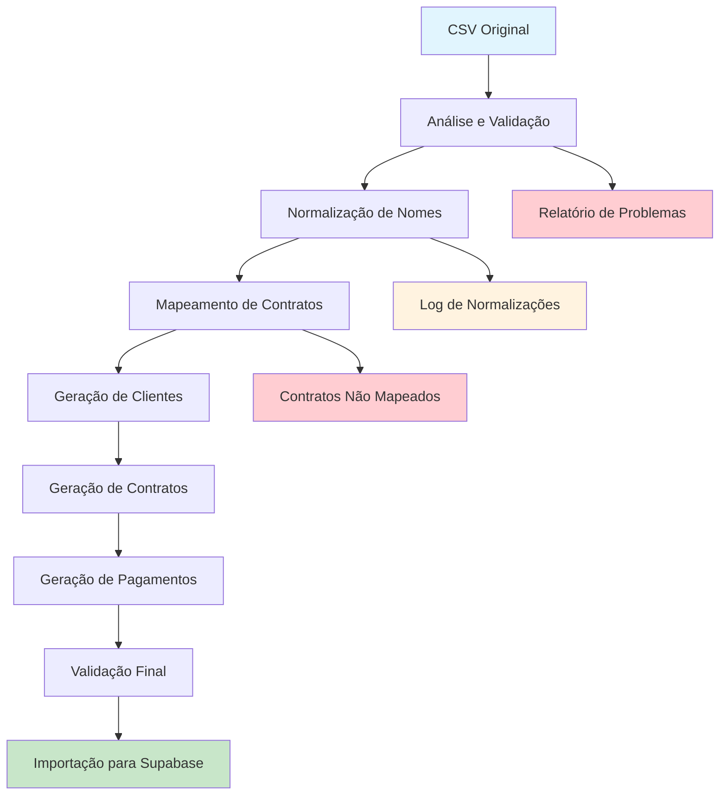

### Estrutura dos Arquivos

#### 1. Scripts Python (Diretório `importBD/`)

**Scripts Principais:**
- `csv_converter.py` - Conversor principal de CSV
- `csv_converter_payments.py` - Processamento específico de pagamentos
- `rebuild_payments.py` - Reconstrução de cronograma de pagamentos
- `import_payments_supabase.py` - Importação para Supabase

**Scripts de Análise e Correção:**
- `analyze_mapping_issues.py` - Análise de problemas de mapeamento
- `compare_successful_names.py` - Comparação de nomes bem-sucedidos
- `fix_contract_mapping.py` - Correção de mapeamentos
- `analyze_remaining_30_percent.py` - Análise de contratos não processados

#### 2. Scripts JavaScript (Diretório `backend/src/scripts/`)

- `import_contratos_simples.js` - Importação simplificada
- `import_csv_compatible.js` - Importação compatível com CSV
- `import_contratos_ativos.js` - Importação de contratos ativos

### Regras de Negócio Específicas

#### 1. Normalização de Nomes de Clientes

**Algoritmo de Limpeza:**
```python
def normalize_name(name):
    """
    Normaliza nomes de clientes removendo:
    - Parênteses e conteúdo interno
    - Espaços extras
    - Caracteres especiais desnecessários
    """
    if not name or pd.isna(name):
        return None
    
    # Remove parênteses e conteúdo
    name = re.sub(r'\([^)]*\)', '', str(name))
    
    # Remove espaços extras
    name = ' '.join(name.split())
    
    # Remove caracteres especiais no início/fim
    name = name.strip(' -.,')
    
    return name if name else None
```

**Padrões Problemáticos Identificados:**
- Nomes com "sem contrato" → Ignorados
- Nomes muito longos (>100 caracteres) → Truncados
- Nomes com números → Analisados individualmente
- Nomes com caracteres especiais → Limpos automaticamente

#### 2. Determinação de Status de Pagamento

**Regra Principal:**
```python
def determine_payment_status(amount):
    """
    Determina status baseado no sinal do valor:
    - Valor negativo = Pagamento realizado (paid)
    - Valor positivo = Pagamento pendente (pending)
    """
    if amount < 0:
        return 'paid'
    elif amount > 0:
        return 'pending'
    else:
        return 'cancelled'  # Valor zero
```

**Lógica de Processamento:**
- **Parcelas Pagas**: Valores negativos no CSV original
- **Parcelas Pendentes**: Valores positivos no CSV original
- **Entrada (Down Payment)**: Primeira parcela com valor negativo
- **Multas e Juros**: Calculados automaticamente para parcelas em atraso

#### 3. Mapeamento de Contratos

**Estratégia de Busca:**
1. **Busca Exata**: Nome completo + documento
2. **Busca Parcial**: Primeiras palavras do nome
3. **Busca Fuzzy**: Similaridade de strings (>85%)
4. **Busca por Documento**: Apenas CPF/CNPJ

**Algoritmo de Mapeamento:**
```python
def map_contract_to_client(contract_data):
    """
    Mapeia contrato para cliente existente ou cria novo
    """
    client_name = normalize_name(contract_data['client_name'])
    
    # 1. Busca exata
    client = find_exact_match(client_name, contract_data['document'])
    if client:
        return client
    
    # 2. Busca parcial
    client = find_partial_match(client_name)
    if client:
        return client
    
    # 3. Busca fuzzy
    client = find_fuzzy_match(client_name, threshold=0.85)
    if client:
        return client
    
    # 4. Criar novo cliente
    return create_new_client(contract_data)
```

#### 4. Geração de IDs Únicos

**Sistema de IDs:**
- **Clientes**: UUID v4 gerado automaticamente
- **Contratos**: Baseado em hash do nome + documento + data
- **Pagamentos**: Sequencial por contrato

```python
def generate_contract_id(client_name, document, start_date):
    """
    Gera ID único para contrato baseado em dados únicos
    """
    unique_string = f"{client_name}_{document}_{start_date}"
    return str(uuid.uuid5(uuid.NAMESPACE_DNS, unique_string))
```

### Processo de Importação Detalhado

#### Fase 1: Análise Inicial
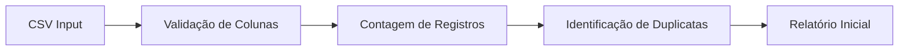

**Validações Realizadas:**
- Presença de colunas obrigatórias
- Formato de datas
- Valores numéricos válidos
- Documentos (CPF/CNPJ) válidos

#### Fase 2: Processamento de Clientes
```python
# Exemplo de processamento
def process_clients(csv_data):
    clients = {}
    for row in csv_data:
        normalized_name = normalize_name(row['client_name'])
        if normalized_name and is_valid_client(row):
            client_id = generate_client_id(normalized_name, row['document'])
            clients[client_id] = {
                'id': client_id,
                'name': normalized_name,
                'document': clean_document(row['document']),
                'email': row.get('email'),
                'phone': row.get('phone'),
                # ... outros campos
            }
    return clients
```

#### Fase 3: Processamento de Contratos
```python
def process_contracts(csv_data, clients_map):
    contracts = {}
    for row in csv_data:
        client_id = find_client_id(row, clients_map)
        if client_id:
            contract = {
                'id': generate_contract_id(row),
                'client_id': client_id,
                'contract_number': row['contract_number'],
                'total_amount': abs(float(row['total_amount'])),
                'installments': int(row['installments']),
                'start_date': parse_date(row['start_date']),
                'status': determine_contract_status(row)
            }
            contracts[contract['id']] = contract
    return contracts
```

#### Fase 4: Geração de Cronograma de Pagamentos
```python
def generate_payment_schedule(contract):
    payments = []
    start_date = contract['start_date']
    installment_amount = contract['total_amount'] / contract['installments']
    
    for i in range(contract['installments']):
        due_date = start_date + relativedelta(months=i)
        payment = {
            'id': f"{contract['id']}_payment_{i+1}",
            'contract_id': contract['id'],
            'installment_number': i + 1,
            'due_date': due_date,
            'amount': installment_amount,
            'status': 'pending'
        }
        payments.append(payment)
    
    return payments
```

### Tratamento de Casos Especiais

#### 1. Contratos Liquidados
- **Identificação**: Status "liquidado" no CSV original
- **Processamento**: Todas as parcelas marcadas como "paid"
- **Data de Liquidação**: Última data de pagamento registrada

#### 2. Contratos com Entrada
- **Detecção**: Primeira parcela com valor negativo
- **Processamento**: Separada como `down_payment`
- **Cronograma**: Ajustado para parcelas restantes

#### 3. Nomes Duplicados
- **Estratégia**: Verificação por documento (CPF/CNPJ)
- **Resolução**: Merge de informações quando possível
- **Log**: Registro de todas as duplicatas encontradas

#### 4. Datas Inválidas
- **Validação**: Formato DD/MM/YYYY ou YYYY-MM-DD
- **Correção**: Tentativa de parsing com múltiplos formatos
- **Fallback**: Data atual para casos irrecuperáveis

### Relatórios de Importação

#### 1. Relatório de Sucesso
```json
{
  "summary": {
    "total_records": 15000,
    "clients_created": 8500,
    "contracts_created": 12000,
    "payments_generated": 180000,
    "success_rate": 95.2
  },
  "processing_time": "00:15:32",
  "files_generated": [
    "clients.csv",
    "contracts.csv", 
    "payments.csv"
  ]
}
```

#### 2. Relatório de Problemas
```json
{
  "issues": {
    "invalid_names": 150,
    "invalid_documents": 45,
    "unmapped_contracts": 300,
    "date_parsing_errors": 25
  },
  "details": [
    {
      "type": "invalid_name",
      "record": 1250,
      "issue": "Nome contém apenas números",
      "value": "123456789"
    }
  ]
}
```

### Configurações e Parâmetros

#### Arquivo de Configuração (`config.json`)
```json
{
  "csv_settings": {
    "encoding": "utf-8",
    "delimiter": ",",
    "date_format": "DD/MM/YYYY"
  },
  "validation": {
    "min_name_length": 3,
    "max_name_length": 100,
    "fuzzy_match_threshold": 0.85
  },
  "processing": {
    "batch_size": 1000,
    "max_retries": 3,
    "timeout_seconds": 300
  }
}
```

### Monitoramento e Logs

#### Sistema de Logs
- **Nível DEBUG**: Detalhes de cada registro processado
- **Nível INFO**: Progresso geral e estatísticas
- **Nível WARNING**: Problemas não críticos
- **Nível ERROR**: Falhas que impedem processamento

#### Métricas Coletadas
- Taxa de sucesso por tipo de registro
- Tempo de processamento por fase
- Uso de memória durante importação
- Número de tentativas de mapeamento

---

## 📊 Estatísticas e KPIs Avançados

O sistema oferece um conjunto abrangente de métricas e análises para suporte à tomada de decisões estratégicas e operacionais.

### Dashboard Executivo - Métricas Principais

#### KPIs Financeiros Essenciais

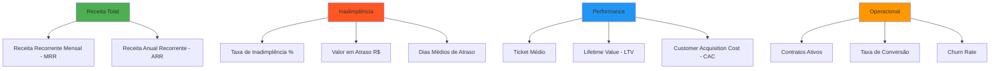

### Análises Avançadas

#### 1. Customer Lifetime Value (LTV)

**Fórmula de Cálculo:**
```sql
-- LTV Básico
WITH customer_metrics AS (
    SELECT 
        c.id as client_id,
        c.name,
        COUNT(DISTINCT ct.id) as total_contracts,
        SUM(ct.total_amount) as total_revenue,
        AVG(ct.total_amount) as avg_contract_value,
        MIN(ct.start_date) as first_contract_date,
        MAX(ct.start_date) as last_contract_date,
        EXTRACT(DAYS FROM (MAX(ct.start_date) - MIN(ct.start_date))) / 365.0 as customer_lifespan_years
    FROM clients c
    JOIN contracts ct ON c.id = ct.client_id
    WHERE ct.status = 'active'
    GROUP BY c.id, c.name
)
SELECT 
    client_id,
    name,
    total_revenue,
    customer_lifespan_years,
    CASE 
        WHEN customer_lifespan_years > 0 
        THEN total_revenue / customer_lifespan_years 
        ELSE total_revenue 
    END as ltv_annual,
    total_contracts,
    avg_contract_value
FROM customer_metrics
ORDER BY ltv_annual DESC;
```

**Segmentação de LTV:**
- **Alto Valor (LTV > R$ 50.000)**: Clientes premium com múltiplos contratos
- **Médio Valor (LTV R$ 10.000 - R$ 50.000)**: Base sólida de clientes
- **Baixo Valor (LTV < R$ 10.000)**: Oportunidades de upselling

#### 2. Análise de Cohort

**Cohort de Retenção por Mês:**
```sql
WITH monthly_cohorts AS (
    SELECT 
        DATE_TRUNC('month', ct.start_date) as cohort_month,
        c.id as client_id,
        ct.id as contract_id,
        ct.start_date
    FROM clients c
    JOIN contracts ct ON c.id = ct.client_id
),
cohort_data AS (
    SELECT 
        cohort_month,
        COUNT(DISTINCT client_id) as cohort_size,
        -- Retenção após 1 mês
        COUNT(DISTINCT CASE 
            WHEN EXISTS (
                SELECT 1 FROM contracts ct2 
                WHERE ct2.client_id = monthly_cohorts.client_id 
                AND ct2.start_date >= cohort_month + INTERVAL '1 month'
            ) THEN client_id 
        END) as retained_1_month,
        -- Retenção após 6 meses
        COUNT(DISTINCT CASE 
            WHEN EXISTS (
                SELECT 1 FROM contracts ct2 
                WHERE ct2.client_id = monthly_cohorts.client_id 
                AND ct2.start_date >= cohort_month + INTERVAL '6 months'
            ) THEN client_id 
        END) as retained_6_months
    FROM monthly_cohorts
    GROUP BY cohort_month
)
SELECT 
    cohort_month,
    cohort_size,
    retained_1_month,
    retained_6_months,
    ROUND((retained_1_month::DECIMAL / cohort_size) * 100, 2) as retention_rate_1_month,
    ROUND((retained_6_months::DECIMAL / cohort_size) * 100, 2) as retention_rate_6_months
FROM cohort_data
ORDER BY cohort_month DESC;
```

#### 3. Análise de Inadimplência Avançada

**Métricas de Inadimplência:**
```sql
-- Dashboard de Inadimplência
WITH payment_analysis AS (
    SELECT 
        p.id,
        p.contract_id,
        p.client_id,
        p.due_date,
        p.amount,
        p.paid_amount,
        p.status,
        CURRENT_DATE - p.due_date as days_overdue,
        CASE 
            WHEN p.status = 'overdue' AND CURRENT_DATE - p.due_date <= 30 THEN '1-30 dias'
            WHEN p.status = 'overdue' AND CURRENT_DATE - p.due_date <= 60 THEN '31-60 dias'
            WHEN p.status = 'overdue' AND CURRENT_DATE - p.due_date <= 90 THEN '61-90 dias'
            WHEN p.status = 'overdue' AND CURRENT_DATE - p.due_date > 90 THEN '90+ dias'
            ELSE 'Em dia'
        END as overdue_bucket
    FROM payments p
    WHERE p.status IN ('pending', 'overdue')
)
SELECT 
    overdue_bucket,
    COUNT(*) as payment_count,
    SUM(amount - paid_amount) as total_overdue_amount,
    AVG(days_overdue) as avg_days_overdue,
    COUNT(DISTINCT client_id) as unique_clients_affected
FROM payment_analysis
GROUP BY overdue_bucket
ORDER BY 
    CASE overdue_bucket
        WHEN 'Em dia' THEN 1
        WHEN '1-30 dias' THEN 2
        WHEN '31-60 dias' THEN 3
        WHEN '61-90 dias' THEN 4
        WHEN '90+ dias' THEN 5
    END;
```

#### 4. Análise de Performance por Filial

**Ranking de Filiais:**
```sql
WITH branch_performance AS (
    SELECT 
        b.id as branch_id,
        b.name as branch_name,
        COUNT(DISTINCT c.id) as total_clients,
        COUNT(DISTINCT ct.id) as total_contracts,
        SUM(ct.total_amount) as total_revenue,
        AVG(ct.total_amount) as avg_contract_value,
        -- Taxa de inadimplência
        COUNT(CASE WHEN p.status = 'overdue' THEN p.id END)::DECIMAL / 
        NULLIF(COUNT(p.id), 0) * 100 as default_rate,
        -- Receita média por cliente
        SUM(ct.total_amount) / NULLIF(COUNT(DISTINCT c.id), 0) as revenue_per_client
    FROM branches b
    LEFT JOIN clients c ON b.id = c.branch_id
    LEFT JOIN contracts ct ON c.id = ct.client_id
    LEFT JOIN payments p ON ct.id = p.contract_id
    WHERE b.is_active = true
    GROUP BY b.id, b.name
)
SELECT 
    branch_name,
    total_clients,
    total_contracts,
    ROUND(total_revenue, 2) as total_revenue,
    ROUND(avg_contract_value, 2) as avg_contract_value,
    ROUND(default_rate, 2) as default_rate_percent,
    ROUND(revenue_per_client, 2) as revenue_per_client,
    -- Ranking
    RANK() OVER (ORDER BY total_revenue DESC) as revenue_rank,
    RANK() OVER (ORDER BY default_rate ASC) as quality_rank
FROM branch_performance
ORDER BY total_revenue DESC;
```

### Dashboards Especializados

#### 1. Dashboard Financeiro

**Métricas Principais:**
- **Receita Mensal Recorrente (MRR)**
- **Receita Anual Recorrente (ARR)**
- **Fluxo de Caixa Projetado**
- **Margem de Contribuição**

```sql
-- MRR Calculation
WITH monthly_revenue AS (
    SELECT 
        DATE_TRUNC('month', p.due_date) as month,
        SUM(p.amount) as monthly_revenue,
        COUNT(DISTINCT p.contract_id) as active_contracts
    FROM payments p
    WHERE p.status IN ('paid', 'pending')
    AND p.due_date >= CURRENT_DATE - INTERVAL '12 months'
    GROUP BY DATE_TRUNC('month', p.due_date)
)
SELECT 
    month,
    monthly_revenue as mrr,
    monthly_revenue * 12 as arr,
    active_contracts,
    LAG(monthly_revenue) OVER (ORDER BY month) as previous_mrr,
    ((monthly_revenue - LAG(monthly_revenue) OVER (ORDER BY month)) / 
     NULLIF(LAG(monthly_revenue) OVER (ORDER BY month), 0)) * 100 as growth_rate
FROM monthly_revenue
ORDER BY month DESC;
```

#### 2. Dashboard Operacional

**Métricas de Eficiência:**
- **Tempo Médio de Processamento de Contratos**
- **Taxa de Conversão de Leads**
- **Produtividade por Usuário**
- **Volume de Transações por Período**

#### 3. Dashboard de Risco

**Indicadores de Risco:**
- **Concentração de Clientes (Curva ABC)**
- **Análise de Vencimentos**
- **Provisão para Devedores Duvidosos**
- **Stress Testing de Cenários**

```sql
-- Análise ABC de Clientes
WITH client_revenue AS (
    SELECT 
        c.id,
        c.name,
        SUM(ct.total_amount) as total_revenue,
        COUNT(ct.id) as contract_count
    FROM clients c
    JOIN contracts ct ON c.id = ct.client_id
    GROUP BY c.id, c.name
),
ranked_clients AS (
    SELECT 
        *,
        SUM(total_revenue) OVER () as total_company_revenue,
        SUM(total_revenue) OVER (ORDER BY total_revenue DESC) as cumulative_revenue,
        ROW_NUMBER() OVER (ORDER BY total_revenue DESC) as revenue_rank
    FROM client_revenue
)
SELECT 
    id,
    name,
    total_revenue,
    contract_count,
    revenue_rank,
    ROUND((total_revenue / total_company_revenue) * 100, 2) as revenue_percentage,
    ROUND((cumulative_revenue / total_company_revenue) * 100, 2) as cumulative_percentage,
    CASE 
        WHEN (cumulative_revenue / total_company_revenue) <= 0.8 THEN 'A'
        WHEN (cumulative_revenue / total_company_revenue) <= 0.95 THEN 'B'
        ELSE 'C'
    END as abc_classification
FROM ranked_clients
ORDER BY total_revenue DESC;
```

### Relatórios Automatizados

#### 1. Relatório Diário de Operações
- Novos contratos criados
- Pagamentos recebidos
- Parcelas vencidas
- Alertas de inadimplência

#### 2. Relatório Semanal Gerencial
- Performance por filial
- Análise de tendências
- KPIs principais
- Ações recomendadas

#### 3. Relatório Mensal Executivo
- Análise de cohort
- LTV por segmento
- Projeções financeiras
- Análise competitiva

### Alertas e Notificações Inteligentes

#### Sistema de Alertas Automáticos

```sql
-- Alertas de Risco
CREATE OR REPLACE FUNCTION generate_risk_alerts()
RETURNS TABLE (
    alert_type VARCHAR,
    priority VARCHAR,
    message TEXT,
    affected_count INTEGER,
    recommended_action TEXT
) AS $$
BEGIN
    -- Alerta de inadimplência alta
    RETURN QUERY
    SELECT 
        'HIGH_DEFAULT_RATE'::VARCHAR,
        'HIGH'::VARCHAR,
        'Taxa de inadimplência acima de 15%'::TEXT,
        COUNT(*)::INTEGER,
        'Revisar política de crédito e intensificar cobrança'::TEXT
    FROM payments p
    WHERE p.status = 'overdue' 
    AND CURRENT_DATE - p.due_date > 30
    HAVING COUNT(*) > (SELECT COUNT(*) * 0.15 FROM payments WHERE status IN ('paid', 'pending', 'overdue'));
    
    -- Alerta de concentração de clientes
    RETURN QUERY
    WITH top_clients AS (
        SELECT SUM(ct.total_amount) as top_10_revenue
        FROM (
            SELECT c.id, SUM(ct.total_amount) as client_revenue
            FROM clients c
            JOIN contracts ct ON c.id = ct.client_id
            GROUP BY c.id
            ORDER BY client_revenue DESC
            LIMIT 10
        ) top_clients_sub
        JOIN contracts ct ON top_clients_sub.id = ct.client_id
    )
    SELECT 
        'CLIENT_CONCENTRATION'::VARCHAR,
        'MEDIUM'::VARCHAR,
        'Top 10 clientes representam mais de 50% da receita'::TEXT,
        10::INTEGER,
        'Diversificar base de clientes'::TEXT
    FROM top_clients
    WHERE top_10_revenue > (SELECT SUM(total_amount) * 0.5 FROM contracts);
END;
$$ LANGUAGE plpgsql;
```

### Análises Preditivas

#### 1. Previsão de Churn
- Modelo baseado em comportamento de pagamento
- Identificação de clientes em risco
- Ações preventivas recomendadas

#### 2. Projeção de Receita
- Análise de sazonalidade
- Tendências de crescimento
- Cenários otimista/pessimista/realista

#### 3. Otimização de Cobrança
- Melhor momento para contato
- Canal de comunicação mais efetivo
- Estratégias personalizadas por perfil

### Métricas de Benchmarking

#### Comparação com Mercado
- Taxa de inadimplência vs. setor
- Ticket médio vs. concorrentes
- Tempo de cobrança vs. best practices
- Satisfação do cliente vs. benchmark

#### KPIs de Excelência Operacional
- **Eficiência de Cobrança**: % de recuperação em 30 dias
- **Qualidade de Dados**: % de registros completos
- **Automação**: % de processos automatizados
- **Satisfação do Cliente**: NPS e CSAT

---

## 🗄️ Estrutura do Banco de Dados

### Diagrama Entidade-Relacionamento (ERD)

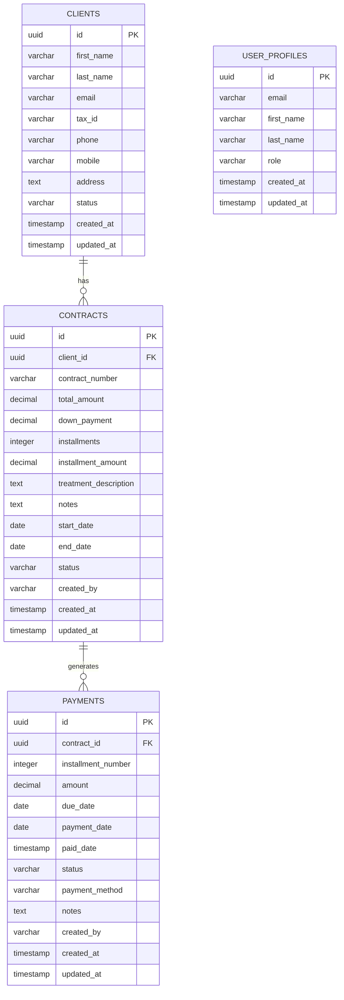

### Tabelas Principais

#### 1. CLIENTS (Clientes)
- **Propósito**: Armazenar informações dos clientes
- **Campos principais**: nome, email, documento, telefone, endereço
- **Validações**: email único, documento único
- **Status**: active, inactive

#### 2. CONTRACTS (Contratos)
- **Propósito**: Gerenciar contratos de serviços
- **Campos principais**: valor total, entrada, parcelas, descrição
- **Relacionamento**: N:1 com CLIENTS
- **Status**: draft, active, completed, cancelled, inactive

#### 3. PAYMENTS (Pagamentos)
- **Propósito**: Controlar parcelas e pagamentos
- **Campos principais**: valor, vencimento, status, método
- **Relacionamento**: N:1 com CONTRACTS
- **Status**: pending, paid, overdue, cancelled

---

## 🔌 API Backend

### Estrutura de Rotas

#### Autenticação (`/api/auth`)
```javascript
POST   /login              // Login de usuário
POST   /register           // Registro (admin only)
POST   /logout             // Logout
GET    /profile            // Perfil do usuário
PUT    /profile            // Atualizar perfil
PUT    /change-password    // Alterar senha
POST   /refresh            // Renovar token
```

#### Clientes (`/api/clients`)
```javascript
GET    /                   // Listar clientes (paginado)
GET    /:id                // Obter cliente por ID
POST   /                   // Criar cliente
PUT    /:id                // Atualizar cliente
PATCH  /:id/status         // Alterar status
DELETE /:id                // Deletar cliente (admin)
GET    /search/document/:doc // Buscar por documento
```

#### Contratos (`/api/contracts`)
```javascript
GET    /                   // Listar contratos (paginado)
GET    /:id                // Obter contrato por ID
POST   /                   // Criar contrato
PUT    /:id                // Atualizar contrato
PATCH  /:id/status         // Alterar status
DELETE /:id                // Deletar contrato (admin)
POST   /:id/generate-installments // Gerar parcelas
```

#### Pagamentos (`/api/payments`)
```javascript
GET    /                   // Listar pagamentos (paginado)
GET    /:id                // Obter pagamento por ID
POST   /                   // Criar pagamento
PUT    /:id                // Atualizar pagamento
PATCH  /:id/pay            // Marcar como pago
PATCH  /:id/cancel         // Cancelar pagamento
DELETE /:id                // Deletar pagamento (admin)
GET    /reports/summary    // Relatório de pagamentos
```

#### Dashboard (`/api/dashboard`)
```javascript
GET    /stats              // Estatísticas gerais
GET    /revenue-chart      // Gráfico de receita
GET    /overdue-payments   // Pagamentos vencidos
GET    /upcoming-payments  // Próximos vencimentos
```

### Middleware de Segurança
- **Autenticação**: JWT token validation
- **Autorização**: Role-based access control
- **Rate Limiting**: Proteção contra spam
- **CORS**: Configuração de domínios permitidos
- **Helmet**: Headers de segurança
- **Validação**: Joi schemas para validação de dados

---

## 🎨 Interface Frontend

### Estrutura de Telas

#### 1. **Dashboard (Home)**
- **Arquivo**: `home_screen.dart`
- **Funcionalidade**: Visão geral do sistema
- **Componentes**:
  - Cards com KPIs principais
  - Gráficos de receita
  - Lista de pagamentos vencidos
  - Próximos vencimentos

#### 2. **Gestão de Clientes**
- **Tela Principal**: `clients_screen.dart`
- **Formulário**: `client_form_screen.dart`
- **Funcionalidades**:
  - Listagem com busca e filtros
  - Cadastro e edição
  - Visualização de detalhes
  - Histórico de contratos

#### 3. **Gestão de Contratos**
- **Formulário**: `contract_form_screen.dart`
- **Widget**: `contract_list_widget.dart`
- **Funcionalidades**:
  - Criação de contratos
  - Geração automática de parcelas
  - Controle de status
  - Vinculação com clientes

#### 4. **Gestão de Pagamentos**
- **Formulário**: `payment_form_screen.dart`
- **Widget**: `payment_list_widget.dart`
- **Funcionalidades**:
  - Registro de pagamentos
  - Controle de vencimentos
  - Filtros por status
  - Relatórios de cobrança

#### 5. **Autenticação**
- **Login**: `login_screen.dart`
- **Registro**: `register_screen.dart`
- **Funcionalidades**:
  - Autenticação segura
  - Recuperação de senha
  - Gestão de perfil

### Componentes Reutilizáveis

#### Widgets Principais
```dart
// Cards do Dashboard
DashboardCard
ERPDashboardCard

// Listas
ClientListWidget
ContractListWidget
PaymentListWidget

// Modais e Diálogos
ClientDetailModal
AdvancedSearchModal
DeleteConfirmationDialog

// Layout
ERPLayout
ERPHeader
ERPSidebar
```

### Gerenciamento de Estado
- **Provider Pattern**: Gerenciamento reativo de estado
- **AppProvider**: Estado global da aplicação
- **DashboardProvider**: Dados específicos do dashboard
- **Separação de responsabilidades**: Cada provider com função específica

---

## ⚙️ Funcionalidades Principais

### 1. Gestão de Clientes
- ✅ Cadastro completo com validação
- ✅ Busca avançada por múltiplos campos
- ✅ Controle de status (ativo/inativo)
- ✅ Histórico de contratos por cliente
- ✅ Validação de documentos únicos

### 2. Gestão de Contratos
- ✅ Criação com cálculo automático de parcelas
- ✅ Múltiplos status de controle
- ✅ Vinculação obrigatória com cliente
- ✅ Geração automática de cronograma de pagamentos
- ✅ Controle de entrada e parcelamento

### 3. Gestão de Pagamentos
- ✅ Registro manual e automático
- ✅ Controle de vencimentos
- ✅ Múltiplos métodos de pagamento
- ✅ Status detalhado (pendente, pago, vencido, cancelado)
- ✅ Relatórios de cobrança

### 4. Dashboard Executivo
- ✅ KPIs em tempo real
- ✅ Gráficos de receita por período
- ✅ Alertas de pagamentos vencidos
- ✅ Próximos vencimentos
- ✅ Métricas de conversão

### 5. Relatórios e Analytics
- ✅ Estatísticas de clientes
- ✅ Performance de contratos
- ✅ Análise de pagamentos
- ✅ Taxa de conversão
- ✅ Receita por período

---

## 🔄 Fluxos de Negócio

### Fluxo de Cadastro de Cliente
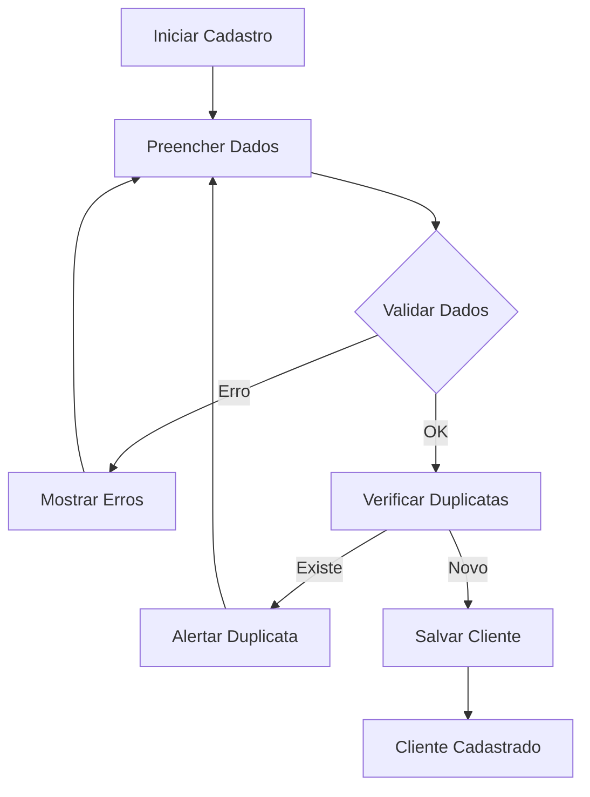

### Fluxo de Criação de Contrato
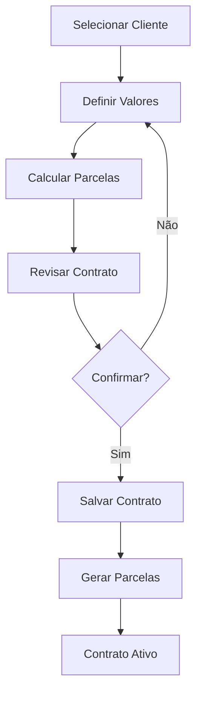

### Fluxo de Pagamento
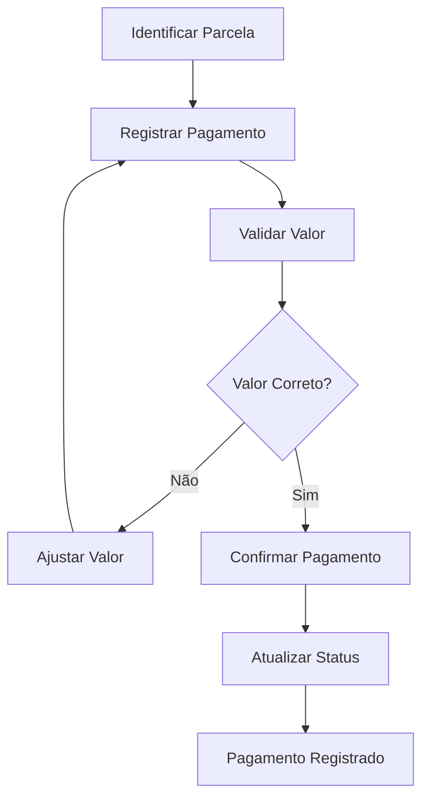

---

## 📊 Estatísticas e KPIs

### Métricas de Clientes
- **Total de Clientes**: Quantidade total cadastrada
- **Clientes Ativos**: Com contratos vigentes
- **Novos Clientes**: Cadastrados no período
- **Taxa de Conversão**: Clientes que viraram contratos

### Métricas de Contratos
- **Total de Contratos**: Quantidade total
- **Contratos Ativos**: Em andamento
- **Valor Total**: Soma de todos os contratos
- **Valor Médio**: Ticket médio por contrato
- **Contratos por Status**: Distribuição por situação

### Métricas de Pagamentos
- **Total de Pagamentos**: Quantidade de parcelas
- **Pagamentos Realizados**: Parcelas pagas
- **Valor Recebido**: Total arrecadado
- **Valor Pendente**: A receber
- **Pagamentos Vencidos**: Em atraso
- **Taxa de Adimplência**: % de pagamentos em dia

### KPIs Calculados
```javascript
// Taxa de Conversão
conversionRate = (totalContracts / totalClients) * 100

// Taxa de Pagamento
paymentRate = (paidPayments / totalPayments) * 100

// Valor Médio do Contrato
averageContractValue = totalContractValue / totalContracts

// Percentual Pago Médio
averagePercentagePaid = totalPaidValue / totalContractValue * 100
```

---

## 🚀 Configuração e Deploy

### Requisitos do Sistema
- **Node.js**: v18 ou superior
- **Flutter**: v3.0 ou superior
- **Supabase**: Conta ativa
- **PostgreSQL**: Via Supabase

### Configuração do Backend
```bash
# Instalar dependências
npm install

# Configurar variáveis de ambiente
cp .env.example .env

# Executar migrações
npm run migrate

# Iniciar servidor
npm run dev
```

### Configuração do Frontend
```bash
# Instalar dependências
flutter pub get

# Executar em modo web
flutter run -d chrome --web-port 8080
```

### Variáveis de Ambiente
```env
# Supabase
SUPABASE_URL=your_supabase_url
SUPABASE_ANON_KEY=your_anon_key
SUPABASE_SERVICE_ROLE_KEY=your_service_role_key

# API
PORT=3000
NODE_ENV=development
JWT_SECRET=your_jwt_secret
```

### Deploy em Produção
1. **Backend**: Deploy no Heroku/Railway/Vercel
2. **Frontend**: Build e deploy no Netlify/Vercel
3. **Database**: Supabase em produção
4. **Monitoramento**: Logs e métricas via Supabase

---

## ⚠️ Limitações e Melhorias Futuras

Esta seção documenta as limitações atuais do sistema e apresenta um roadmap detalhado para futuras melhorias e expansões.

### Limitações Atuais

#### 1. Limitações Técnicas

**Frontend (Flutter Web)**
- **Responsividade**: Otimização limitada para dispositivos móveis
- **Performance**: Carregamento inicial pode ser lento em conexões lentas
- **Compatibilidade**: Algumas funcionalidades podem ter comportamento inconsistente entre navegadores
- **Offline**: Não há suporte para funcionamento offline

**Backend (Node.js + Express)**
- **Escalabilidade**: Arquitetura monolítica pode limitar escalabilidade horizontal
- **Cache**: Sistema de cache limitado, dependente apenas do cache do banco
- **Rate Limiting**: Proteção básica contra ataques de força bruta
- **Monitoramento**: Logs básicos sem sistema de observabilidade avançado

**Banco de Dados (Supabase PostgreSQL)**
- **Backup**: Dependente das políticas de backup do Supabase
- **Replicação**: Sem replicação multi-região configurada
- **Particionamento**: Tabelas grandes podem impactar performance sem particionamento
- **Índices**: Alguns índices compostos podem ser otimizados

#### 2. Limitações Funcionais

**Gestão de Contratos**
- **Tipos de Contrato**: Suporte limitado a contratos complexos (ex: juros compostos, carência)
- **Renegociação**: Processo manual sem workflow automatizado
- **Garantias**: Não há gestão de garantias ou avais
- **Contratos Digitais**: Assinatura digital não implementada

**Sistema de Pagamentos**
- **Integrações**: Limitado a importação CSV, sem integração com gateways de pagamento
- **Conciliação**: Processo manual de conciliação bancária
- **Múltiplas Moedas**: Suporte apenas para Real (BRL)
- **Parcelamento**: Lógica de parcelamento básica

**Relatórios e Analytics**
- **Tempo Real**: Dashboards não são atualizados em tempo real
- **Exportação**: Formatos limitados de exportação (CSV básico)
- **Personalização**: Relatórios não são personalizáveis pelo usuário
- **Drill-down**: Capacidade limitada de análise detalhada

#### 3. Limitações de Segurança

**Autenticação e Autorização**
- **MFA**: Autenticação multifator não implementada
- **SSO**: Sem integração com provedores de identidade corporativos
- **Auditoria**: Logs de auditoria básicos
- **Sessões**: Gerenciamento de sessão simples

**Proteção de Dados**
- **Criptografia**: Dados sensíveis não são criptografados em repouso
- **Mascaramento**: Dados pessoais não são mascarados em ambientes de desenvolvimento
- **LGPD**: Compliance parcial com LGPD/GDPR
- **Backup Seguro**: Backups não são criptografados

### Roadmap de Melhorias

#### 🚀 Fase 1: Otimizações Imediatas (1-3 meses)

**Performance e Estabilidade**
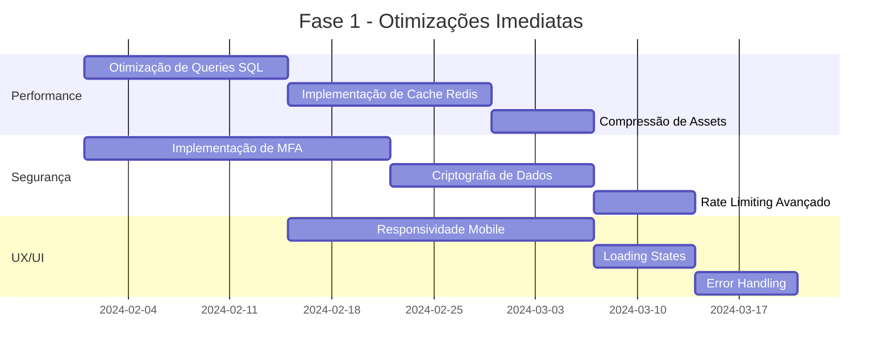

**Melhorias Prioritárias:**

1. **Cache Inteligente**
   ```javascript
   // Implementação de cache em múltiplas camadas
   const cacheStrategy = {
     redis: {
       ttl: 3600, // 1 hora
       keys: ['dashboard_metrics', 'client_list', 'contract_summary']
     },
     memory: {
       ttl: 300, // 5 minutos
       keys: ['user_permissions', 'branch_data']
     },
     browser: {
       ttl: 86400, // 24 horas
       keys: ['static_data', 'user_preferences']
     }
   };
   ```

2. **Otimização de Queries**
   ```sql
   -- Índices compostos para queries frequentes
   CREATE INDEX CONCURRENTLY idx_payments_status_due_date 
   ON payments (status, due_date) 
   WHERE status IN ('pending', 'overdue');
   
   CREATE INDEX CONCURRENTLY idx_contracts_client_status 
   ON contracts (client_id, status) 
   WHERE status = 'active';
   ```

3. **Monitoramento Avançado**
   ```javascript
   // Implementação de métricas de performance
   const monitoring = {
     apm: 'New Relic / DataDog',
     logs: 'ELK Stack',
     metrics: 'Prometheus + Grafana',
     alerts: 'PagerDuty'
   };
   ```

#### 🔧 Fase 2: Funcionalidades Avançadas (3-6 meses)

**Integrações e Automação**

1. **Gateway de Pagamentos**
   ```javascript
   // Integração com múltiplos provedores
   const paymentGateways = {
     pix: ['Mercado Pago', 'PagSeguro', 'Stripe'],
     boleto: ['Banco do Brasil', 'Itaú', 'Bradesco'],
     cartao: ['Cielo', 'Rede', 'Stone']
   };
   ```

2. **Workflow de Cobrança Automatizada**
   ```mermaid
   flowchart TD
       A[Parcela Vencida] --> B{Dias de Atraso}
       B -->|1-3 dias| C[SMS Automático]
       B -->|4-7 dias| D[Email + WhatsApp]
       B -->|8-15 dias| E[Ligação Automática]
       B -->|16-30 dias| F[Carta Registrada]
       B -->|30+ dias| G[Processo Jurídico]
       
       C --> H[Atualizar Status]
       D --> H
       E --> H
       F --> H
       G --> H
   ```

3. **API Pública**
   ```yaml
   # OpenAPI 3.0 Specification
   openapi: 3.0.0
   info:
     title: Finance Management API
     version: 2.0.0
   paths:
     /api/v2/contracts:
       get:
         summary: Lista contratos
         parameters:
           - name: status
             in: query
             schema:
               type: string
               enum: [active, completed, cancelled]
   ```

#### 🏗️ Fase 3: Arquitetura Escalável (6-12 meses)

**Migração para Microserviços**

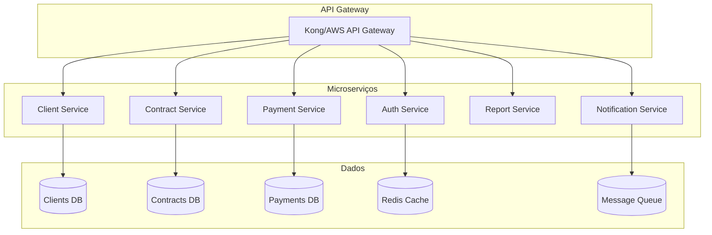

**Tecnologias Propostas:**
- **Containerização**: Docker + Kubernetes
- **Service Mesh**: Istio
- **Message Broker**: Apache Kafka
- **API Gateway**: Kong ou AWS API Gateway
- **Observabilidade**: Jaeger + Prometheus + Grafana

#### 🤖 Fase 4: Inteligência Artificial (12+ meses)

**Machine Learning e IA**

1. **Previsão de Inadimplência**
   ```python
   # Modelo de ML para predição de churn
   from sklearn.ensemble import RandomForestClassifier
   
   features = [
       'payment_history_score',
       'days_since_last_payment',
       'contract_value',
       'client_age',
       'income_level',
       'payment_method_preference'
   ]
   
   model = RandomForestClassifier(
       n_estimators=100,
       max_depth=10,
       random_state=42
   )
   ```

2. **Otimização de Cobrança**
   ```python
   # Sistema de recomendação para estratégias de cobrança
   def recommend_collection_strategy(client_profile):
       if client_profile['risk_score'] > 0.8:
           return 'immediate_contact'
       elif client_profile['preferred_channel'] == 'whatsapp':
           return 'whatsapp_sequence'
       else:
           return 'email_sequence'
   ```

3. **Chatbot Inteligente**
   ```javascript
   // Integração com GPT para atendimento automatizado
   const chatbot = {
     provider: 'OpenAI GPT-4',
     capabilities: [
       'consulta_saldo',
       'segunda_via_boleto',
       'renegociacao_divida',
       'informacoes_contrato'
     ],
     fallback: 'human_agent'
   };
   ```

### Melhorias de UX/UI

#### Design System Avançado

**Componentes Reutilizáveis**
```dart
// Sistema de Design Tokens
class DesignTokens {
  static const colors = {
    'primary': Color(0xFF2196F3),
    'secondary': Color(0xFF4CAF50),
    'error': Color(0xFFFF5722),
    'warning': Color(0xFFFF9800),
  };
  
  static const typography = {
    'h1': TextStyle(fontSize: 32, fontWeight: FontWeight.bold),
    'h2': TextStyle(fontSize: 24, fontWeight: FontWeight.w600),
    'body': TextStyle(fontSize: 16, fontWeight: FontWeight.normal),
  };
}
```

**Acessibilidade**
- Suporte completo a leitores de tela
- Navegação por teclado
- Alto contraste
- Textos alternativos para imagens
- Compliance com WCAG 2.1 AA

#### Progressive Web App (PWA)

```javascript
// Service Worker para funcionalidade offline
self.addEventListener('fetch', event => {
  if (event.request.url.includes('/api/')) {
    event.respondWith(
      caches.match(event.request)
        .then(response => response || fetch(event.request))
    );
  }
});
```

### Integrações Futuras

#### ERP e Sistemas Legados

**Conectores Disponíveis:**
- SAP Business One
- TOTVS Protheus
- Sage X3
- Oracle NetSuite
- Sistemas customizados via API REST

#### Serviços Financeiros

**Integrações Bancárias:**
- Open Banking (PIX, TED, DOC)
- Conciliação automática
- Extrato bancário em tempo real
- Antecipação de recebíveis

#### Compliance e Regulamentação

**Adequações Regulatórias:**
- LGPD/GDPR compliance completo
- SOX compliance para empresas públicas
- PCI DSS para dados de cartão
- ISO 27001 para segurança da informação

### Métricas de Sucesso

#### KPIs de Melhoria

**Performance:**
- Tempo de carregamento < 2 segundos
- Uptime > 99.9%
- Tempo de resposta da API < 200ms
- Zero downtime deployments

**Usabilidade:**
- Net Promoter Score (NPS) > 70
- Task Success Rate > 95%
- User Error Rate < 2%
- Time to Complete Task redução de 50%

**Negócio:**
- Redução de 30% no tempo de cobrança
- Aumento de 25% na taxa de recuperação
- Diminuição de 40% em tarefas manuais
- ROI > 300% em 12 meses

### Investimento Estimado

#### Breakdown de Custos

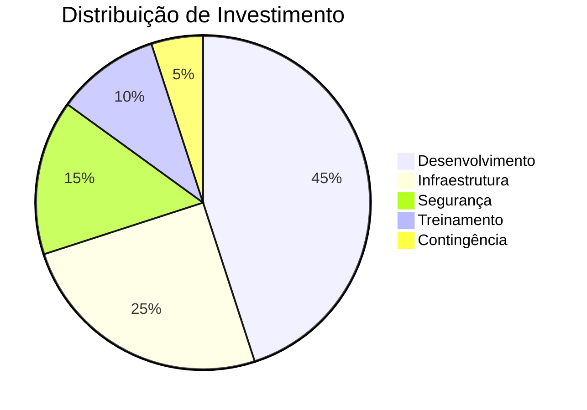

**Estimativa por Fase:**
- **Fase 1**: R$ 150.000 - R$ 200.000
- **Fase 2**: R$ 300.000 - R$ 400.000
- **Fase 3**: R$ 500.000 - R$ 700.000
- **Fase 4**: R$ 400.000 - R$ 600.000

**Total Estimado**: R$ 1.350.000 - R$ 1.900.000 (24 meses)

### Cronograma Executivo

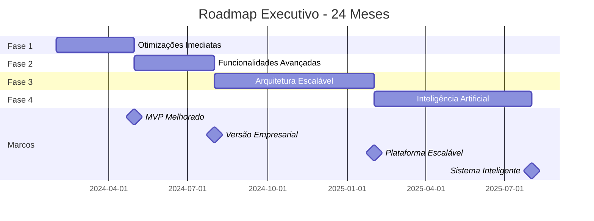

---

## 🔒 Considerações de Performance e Segurança

### Performance

#### Otimizações Atuais

**Frontend (Flutter Web)**
- **Code Splitting**: Carregamento sob demanda de módulos
- **Tree Shaking**: Remoção de código não utilizado
- **Asset Optimization**: Compressão de imagens e recursos
- **Lazy Loading**: Carregamento tardio de componentes pesados

**Backend (Node.js)**
- **Connection Pooling**: Pool de conexões com o banco de dados
- **Query Optimization**: Índices e consultas otimizadas
- **Compression**: Compressão gzip/brotli para responses
- **Caching**: Cache em memória para dados frequentes

#### Métricas de Performance

**Tempos de Resposta Atuais:**
- Dashboard principal: ~800ms
- Listagem de clientes: ~400ms
- Criação de contrato: ~600ms
- Relatórios simples: ~1.2s

**Metas de Performance:**
- Todas as páginas < 2s (First Contentful Paint)
- APIs < 500ms (95th percentile)
- Uptime > 99.5%
- Zero data loss

### Segurança

#### Implementações Atuais

**Autenticação e Autorização**
```javascript
// JWT com refresh tokens
const authConfig = {
  accessTokenExpiry: '15m',
  refreshTokenExpiry: '7d',
  algorithm: 'HS256',
  issuer: 'finance-app'
};

// Role-based access control
const permissions = {
  admin: ['read', 'write', 'delete', 'manage_users'],
  manager: ['read', 'write', 'manage_branch'],
  user: ['read', 'write_own']
};
```

**Validação de Dados**
```javascript
// Joi schemas para validação
const contractSchema = Joi.object({
  client_id: Joi.string().uuid().required(),
  total_amount: Joi.number().positive().max(1000000).required(),
  installments: Joi.number().integer().min(1).max(60).required()
});
```

**Proteção contra Ataques**
- **SQL Injection**: Prepared statements e ORM
- **XSS**: Sanitização de inputs e CSP headers
- **CSRF**: Tokens CSRF em formulários
- **Rate Limiting**: Limite de requisições por IP

#### Auditoria e Logs

**Sistema de Auditoria**
```sql
-- Tabela de auditoria
CREATE TABLE audit_logs (
    id UUID PRIMARY KEY DEFAULT gen_random_uuid(),
    user_id UUID REFERENCES users(id),
    action VARCHAR(50) NOT NULL,
    table_name VARCHAR(50) NOT NULL,
    record_id UUID,
    old_values JSONB,
    new_values JSONB,
    ip_address INET,
    user_agent TEXT,
    created_at TIMESTAMP DEFAULT CURRENT_TIMESTAMP
);
```

**Monitoramento de Segurança**
- Tentativas de login falhadas
- Acessos suspeitos
- Alterações em dados sensíveis
- Exportações de dados

#### Compliance e Regulamentação

**LGPD (Lei Geral de Proteção de Dados)**
- Consentimento explícito para coleta de dados
- Direito ao esquecimento (exclusão de dados)
- Portabilidade de dados
- Notificação de vazamentos em 72h

**Medidas de Proteção de Dados**
```javascript
// Criptografia de dados sensíveis
const crypto = require('crypto');

function encryptSensitiveData(data) {
  const cipher = crypto.createCipher('aes-256-gcm', process.env.ENCRYPTION_KEY);
  let encrypted = cipher.update(data, 'utf8', 'hex');
  encrypted += cipher.final('hex');
  return encrypted;
}

// Mascaramento de dados em logs
function maskSensitiveInfo(data) {
  return {
    ...data,
    tax_id: data.tax_id?.replace(/(\d{3})\d{3}(\d{3})/, '$1***$2'),
    email: data.email?.replace(/(.{2}).*(@.*)/, '$1***$2')
  };
}
```

### Backup e Recuperação

#### Estratégia de Backup

**Backup Automático (Supabase)**
- Backup diário automático
- Retenção de 7 dias (plano gratuito)
- Point-in-time recovery
- Backup cross-region

**Backup Manual**
```bash
# Script de backup manual
#!/bin/bash
DATE=$(date +%Y%m%d_%H%M%S)
pg_dump $DATABASE_URL > backup_$DATE.sql
aws s3 cp backup_$DATE.sql s3://finance-backups/
```

#### Plano de Recuperação de Desastres

**RTO (Recovery Time Objective)**: 4 horas
**RPO (Recovery Point Objective)**: 1 hora

**Procedimentos de Recuperação:**
1. Identificação do problema
2. Ativação do plano de contingência
3. Restauração do backup mais recente
4. Validação da integridade dos dados
5. Comunicação aos usuários
6. Análise post-mortem

### Monitoramento e Alertas

#### Métricas Monitoradas

**Infraestrutura**
- CPU e memória dos servidores
- Latência de rede
- Espaço em disco
- Conexões de banco de dados

**Aplicação**
- Tempo de resposta das APIs
- Taxa de erro (4xx, 5xx)
- Throughput de requisições
- Tempo de carregamento das páginas

**Negócio**
- Número de usuários ativos
- Transações por minuto
- Taxa de conversão
- Receita por período

#### Sistema de Alertas

```javascript
// Configuração de alertas
const alerts = {
  critical: {
    response_time: '> 5s',
    error_rate: '> 5%',
    uptime: '< 99%'
  },
  warning: {
    response_time: '> 2s',
    error_rate: '> 2%',
    disk_space: '> 80%'
  }
};
```

### Testes de Segurança

#### Testes Automatizados

**Testes de Penetração**
- Varredura de vulnerabilidades (OWASP ZAP)
- Testes de injeção SQL
- Testes de XSS
- Análise de dependências (npm audit)

**Testes de Carga**
```javascript
// Teste de carga com Artillery
module.exports = {
  config: {
    target: 'https://api.finance-app.com',
    phases: [
      { duration: 60, arrivalRate: 10 },
      { duration: 120, arrivalRate: 50 },
      { duration: 60, arrivalRate: 100 }
    ]
  },
  scenarios: [
    {
      name: 'Login and dashboard',
      flow: [
        { post: { url: '/auth/login', json: { email: 'test@test.com', password: 'test123' } } },
        { get: { url: '/dashboard' } }
      ]
    }
  ]
};
```

### Certificações e Standards

#### Certificações Planejadas
- **ISO 27001**: Gestão de segurança da informação
- **SOC 2 Type II**: Controles de segurança e disponibilidade
- **PCI DSS**: Proteção de dados de cartão (se aplicável)

#### Standards de Desenvolvimento
- **OWASP Top 10**: Mitigação das principais vulnerabilidades
- **NIST Cybersecurity Framework**: Framework de segurança
- **Clean Code**: Práticas de código limpo e seguro

---

## 📝 Considerações Finais

Este sistema foi desenvolvido com foco em:
- **Escalabilidade**: Arquitetura preparada para crescimento
- **Segurança**: Autenticação robusta e validações
- **Usabilidade**: Interface intuitiva e responsiva
- **Manutenibilidade**: Código limpo e bem documentado
- **Performance**: Otimizações de consultas e cache

### Próximas Melhorias
- [ ] Notificações push para vencimentos
- [ ] Integração com gateways de pagamento
- [ ] Relatórios em PDF
- [ ] App mobile nativo
- [ ] Backup automático
- [ ] Auditoria de ações

---

*Documentação gerada automaticamente em {{ date }}*