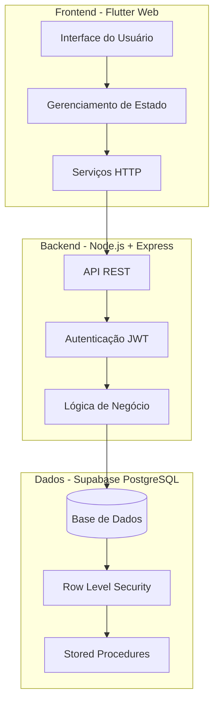
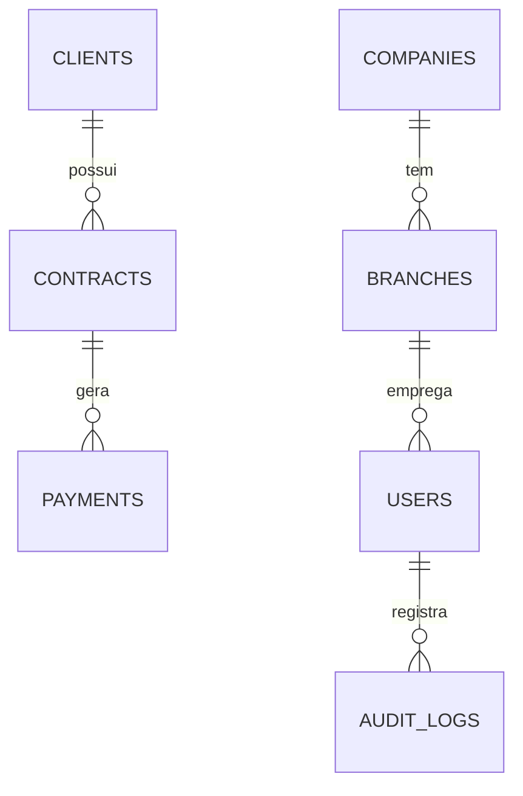
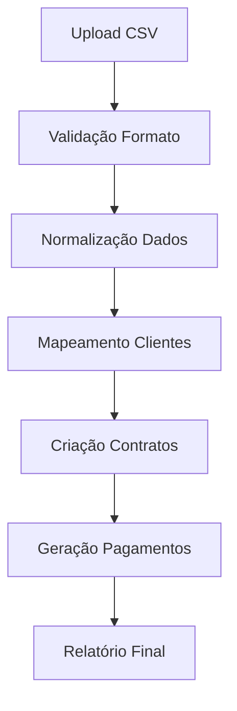

# 📊 Sistema de Gestão Financeira - Documentação Resumida

*Versão resumida da documentação técnica completa*

---

## 📋 Índice

1. [Visão Geral](#-visão-geral)
2. [Arquitetura](#-arquitetura)
3. [Funcionalidades Principais](#-funcionalidades-principais)
4. [Tecnologias](#-tecnologias)
5. [Estrutura do Projeto](#-estrutura-do-projeto)
6. [Banco de Dados](#-banco-de-dados)
7. [APIs Principais](#-apis-principais)
8. [Instalação e Execução](#-instalação-e-execução)
9. [Importação CSV](#-importação-csv)
10. [Dashboards e Relatórios](#-dashboards-e-relatórios)
11. [Segurança](#-segurança)
12. [Limitações e Roadmap](#-limitações-e-roadmap)

---

## 🎯 Visão Geral

Sistema web completo para gestão financeira empresarial, focado em contratos, pagamentos e cobrança. Inspirado no design do Stripe Dashboard e Linear, oferece uma interface moderna e intuitiva para gerenciar operações financeiras.

### Problemas Resolvidos
- **Gestão Manual**: Automatiza processos de cobrança e acompanhamento
- **Dados Dispersos**: Centraliza informações de clientes, contratos e pagamentos
- **Falta de Visibilidade**: Dashboards em tempo real com KPIs financeiros
- **Importação Complexa**: Pipeline inteligente de importação CSV

### Público-Alvo
- Empresas de médio porte
- Instituições financeiras
- Empresas de cobrança
- Gestores financeiros

---

## 🏗️ Arquitetura

### Arquitetura em 3 Camadas



### Justificativas Técnicas

**Flutter Web**: Interface moderna, responsiva e performática
**Node.js + Express**: Escalabilidade, ecosystem rico, desenvolvimento ágil
**Supabase PostgreSQL**: Banco robusto, autenticação integrada, real-time

---

## ⚡ Funcionalidades Principais

### 👥 Gestão de Clientes
- **CRUD Completo**: Criar, visualizar, editar e excluir clientes
- **Validação de Dados**: CPF/CNPJ, email, telefone
- **Histórico**: Contratos e pagamentos por cliente
- **Busca Avançada**: Filtros por nome, documento, status

### 📄 Gestão de Contratos
- **Tipos de Contrato**: Financiamento, empréstimo, cartão de crédito
- **Parcelamento**: Configuração flexível de parcelas
- **Status**: Ativo, concluído, cancelado, liquidado
- **Documentos**: Upload e gestão de arquivos

### 💰 Gestão de Pagamentos
- **Cronograma**: Geração automática de parcelas
- **Status**: Pendente, pago, em atraso, cancelado
- **Métodos**: Boleto, PIX, cartão, dinheiro
- **Cobrança**: Workflow automatizado de cobrança

### 📊 Dashboard e Relatórios
- **KPIs Financeiros**: Receita, inadimplência, conversão
- **Gráficos Interativos**: Evolução temporal, distribuição
- **Filtros Avançados**: Por período, filial, status
- **Exportação**: CSV, PDF (planejado)

### 🔐 Controle de Acesso
- **Autenticação**: JWT com refresh tokens
- **Autorização**: Baseada em roles (admin, manager, user)
- **Auditoria**: Log de todas as ações importantes
- **Segurança**: Validação de dados, rate limiting

---

## 🛠️ Tecnologias

### Frontend
- **Flutter 3.24+**: Framework UI multiplataforma
- **Provider**: Gerenciamento de estado
- **HTTP**: Comunicação com APIs
- **Material Design**: Sistema de design

### Backend
- **Node.js 18+**: Runtime JavaScript
- **Express.js**: Framework web
- **JWT**: Autenticação stateless
- **Joi**: Validação de dados
- **Multer**: Upload de arquivos

### Banco de Dados
- **PostgreSQL 15+**: Banco relacional
- **Supabase**: Backend-as-a-Service
- **Row Level Security**: Segurança a nível de linha
- **Índices Otimizados**: Performance de consultas

### DevOps
- **Git**: Controle de versão
- **npm/yarn**: Gerenciamento de dependências
- **Flutter CLI**: Build e deploy
- **Supabase CLI**: Migrações e deploy

---

## 📁 Estrutura do Projeto

```
finance/
├── backend/                 # API Node.js
│   ├── src/
│   │   ├── routes/         # Rotas da API
│   │   ├── middleware/     # Middlewares
│   │   ├── validators/     # Validação Joi
│   │   └── utils/          # Utilitários
│   └── package.json
├── finance_app/            # Frontend Flutter
│   ├── lib/
│   │   ├── screens/        # Telas da aplicação
│   │   ├── providers/      # Gerenciamento de estado
│   │   ├── services/       # Serviços HTTP
│   │   ├── models/         # Modelos de dados
│   │   └── widgets/        # Componentes reutilizáveis
│   └── pubspec.yaml
├── importBD/               # Scripts de importação
└── DOCUMENTACAO_COMPLETA.md
```

---

## 🗄️ Banco de Dados

### Tabelas Principais

**CLIENTS** - Informações dos clientes
- `id`, `name`, `email`, `phone`, `tax_id`, `address`

**CONTRACTS** - Contratos financeiros
- `id`, `client_id`, `contract_number`, `total_amount`, `installments`, `status`

**PAYMENTS** - Cronograma de pagamentos
- `id`, `contract_id`, `installment_number`, `amount`, `due_date`, `status`

**USERS** - Usuários do sistema
- `id`, `email`, `role`, `company_id`, `branch_id`

### Relacionamentos



---

## 🔌 APIs Principais

### Autenticação
```
POST /auth/login          # Login do usuário
POST /auth/refresh        # Renovar token
POST /auth/logout         # Logout
```

### Clientes
```
GET    /clients           # Listar clientes
POST   /clients           # Criar cliente
GET    /clients/:id       # Buscar cliente
PUT    /clients/:id       # Atualizar cliente
DELETE /clients/:id       # Excluir cliente
```

### Contratos
```
GET    /contracts         # Listar contratos
POST   /contracts         # Criar contrato
GET    /contracts/:id     # Buscar contrato
PUT    /contracts/:id     # Atualizar contrato
```

### Pagamentos
```
GET    /payments          # Listar pagamentos
PUT    /payments/:id      # Atualizar pagamento
GET    /payments/overdue  # Pagamentos em atraso
```

### Dashboard
```
GET    /dashboard/metrics # KPIs principais
GET    /dashboard/charts  # Dados para gráficos
```

---

## 🚀 Instalação e Execução

### Pré-requisitos
- Node.js 18+
- Flutter 3.24+
- Conta Supabase

### Backend
```bash
cd backend
npm install
cp .env.example .env
# Configurar variáveis de ambiente
npm run dev
```

### Frontend
```bash
cd finance_app
flutter pub get
flutter run -d chrome --web-port 8080
```

### Variáveis de Ambiente
```env
SUPABASE_URL=your_supabase_url
SUPABASE_ANON_KEY=your_anon_key
JWT_SECRET=your_jwt_secret
PORT=3000
```

---

## 📥 Importação CSV

### Pipeline de Importação



### Regras de Negócio
- **Normalização de Nomes**: Remove caracteres especiais, padroniza formato
- **Mapeamento Inteligente**: Busca fuzzy para encontrar clientes existentes
- **Validação de Dados**: CPF/CNPJ, datas, valores monetários
- **Tratamento de Duplicatas**: Evita criação de registros duplicados

### Scripts Disponíveis
- `import_clients_supabase.py`: Importa clientes
- `import_contracts_supabase.py`: Importa contratos
- `generate_payments_from_contratos.py`: Gera cronograma de pagamentos

---

## 📈 Dashboards e Relatórios

### KPIs Principais
- **Receita Total**: Soma de todos os pagamentos recebidos
- **Taxa de Inadimplência**: Percentual de pagamentos em atraso
- **Contratos Ativos**: Número de contratos em andamento
- **Ticket Médio**: Valor médio dos contratos

### Gráficos Disponíveis
- **Evolução da Receita**: Linha temporal mensal
- **Distribuição por Status**: Pizza de contratos por status
- **Inadimplência por Período**: Barras de atraso por mês
- **Performance por Filial**: Comparativo entre filiais

### Filtros Avançados
- **Período**: Data início e fim
- **Status**: Ativo, concluído, cancelado
- **Filial**: Filtro por unidade de negócio
- **Valor**: Faixa de valores de contrato

---

## 🔒 Segurança

### Autenticação e Autorização
- **JWT Tokens**: Access token (15min) + Refresh token (7 dias)
- **Role-Based Access**: Admin, Manager, User
- **Row Level Security**: Isolamento de dados por empresa/filial

### Proteção de Dados
- **Validação de Input**: Joi schemas para todas as entradas
- **SQL Injection**: Prepared statements e ORM
- **XSS Protection**: Sanitização de dados
- **Rate Limiting**: Proteção contra ataques de força bruta

### Auditoria
- **Logs de Ação**: Todas as operações importantes são logadas
- **Rastreabilidade**: Histórico de alterações em dados sensíveis
- **Monitoramento**: Alertas para atividades suspeitas

---

## ⚠️ Limitações e Roadmap

### Limitações Atuais
- **Mobile**: Otimização limitada para dispositivos móveis
- **Offline**: Sem suporte para funcionamento offline
- **Integrações**: Limitado a importação CSV
- **Relatórios**: Exportação básica em CSV

### Roadmap (12 meses)

#### Fase 1 (1-3 meses) - Otimizações
- [ ] Cache Redis para performance
- [ ] Responsividade mobile completa
- [ ] Autenticação multifator (MFA)
- [ ] Testes automatizados

#### Fase 2 (3-6 meses) - Funcionalidades
- [ ] Gateway de pagamentos (PIX, boleto)
- [ ] Workflow de cobrança automatizada
- [ ] API pública com documentação
- [ ] Relatórios avançados (PDF)

#### Fase 3 (6-12 meses) - Escalabilidade
- [ ] Arquitetura de microserviços
- [ ] Integração com ERPs
- [ ] Machine Learning para predição
- [ ] App mobile nativo

### Investimento Estimado
- **Fase 1**: R$ 150.000 - R$ 200.000
- **Fase 2**: R$ 300.000 - R$ 400.000
- **Fase 3**: R$ 500.000 - R$ 700.000

---

## 📞 Suporte e Contato

### Documentação Técnica
- **Documentação Completa**: `DOCUMENTACAO_COMPLETA.md`
- **Guia de Refatoração**: `finance_app/REFACTORING_GUIDE.md`
- **README Backend**: `backend/README.md`

### Comandos Úteis
```bash
# Iniciar aplicação completa
./start_app.sh

# Verificar status
./status_app.sh

# Parar aplicação
./stop_app.sh
```

### Estrutura de Logs
- **Backend**: Console logs com timestamp
- **Frontend**: DevTools do navegador
- **Banco**: Supabase Dashboard

---

## 🎯 Considerações Finais

Este sistema representa uma solução completa para gestão financeira, combinando tecnologias modernas com práticas de desenvolvimento sólidas. A arquitetura permite escalabilidade futura e a interface oferece uma experiência de usuário intuitiva.

### Pontos Fortes
- ✅ **Interface Moderna**: Design inspirado em produtos líderes de mercado
- ✅ **Arquitetura Sólida**: Separação clara de responsabilidades
- ✅ **Segurança Robusta**: Múltiplas camadas de proteção
- ✅ **Importação Inteligente**: Pipeline automatizado de dados
- ✅ **Dashboards Ricos**: Visualizações interativas e KPIs

### Próximos Passos
1. **Otimização de Performance**: Cache e otimização de queries
2. **Expansão Mobile**: Versão nativa para iOS/Android
3. **Integrações**: Gateways de pagamento e ERPs
4. **IA/ML**: Predição de inadimplência e otimização de cobrança

---

*Documentação resumida gerada em {{ date }}*
*Para informações detalhadas, consulte DOCUMENTACAO_COMPLETA.md*