# 🚀 Plano de Refatoração Completo - Sistema de Gestão Financeira

## 📋 Índice

1. [Visão Geral da Refatoração](#visão-geral-da-refatoração)
2. [Análise da Estrutura Atual](#análise-da-estrutura-atual)
3. [Nova Arquitetura React Native](#nova-arquitetura-react-native)
4. [Refatoração do Backend](#refatoração-do-backend)
5. [Design System e Componentes](#design-system-e-componentes)
6. [Estrutura de Pastas](#estrutura-de-pastas)
7. [Tecnologias e Dependências](#tecnologias-e-dependências)
8. [Padrões Arquiteturais](#padrões-arquiteturais)
9. [Segurança e Performance](#segurança-e-performance)
10. [Testes Automatizados](#testes-automatizados)
11. [Guia de Implementação](#guia-de-implementação)
12. [Migração de Dados](#migração-de-dados)

---

## 🎯 Visão Geral da Refatoração

### Objetivos da Refatoração

**Principais Motivações:**
- **Modernização Tecnológica**: Migração para React Native com arquitetura mais robusta
- **Design System Unificado**: Implementação baseada no PrimeFaces Ultima para consistência visual
- **Performance Otimizada**: Melhoria significativa na velocidade e responsividade
- **Manutenibilidade**: Código mais limpo, modular e testável
- **Escalabilidade**: Arquitetura preparada para crescimento futuro

**Escopo da Refatoração:**
- ✅ **Frontend**: Migração completa de React Native Expo para React Native puro
- ✅ **Backend**: Refatoração e otimização do Node.js existente
- ✅ **Design System**: Implementação de componentes baseados no PrimeFaces Ultima
- ✅ **Arquitetura**: Adoção de padrões modernos (Clean Architecture, SOLID)
- ✅ **Testes**: Implementação de testes unitários, integração e E2E
- ✅ **Performance**: Otimizações de bundle, lazy loading e caching

---

## 📊 Análise da Estrutura Atual

### Estado Atual da Aplicação

**Frontend (React Native Expo):**
```
finance-app/
├── src/
│   ├── components/          # Componentes UI básicos
│   ├── screens/            # Telas principais (Auth, Clients, Contracts, Payments, Dashboard)
│   ├── navigation/         # Navegação com React Navigation
│   ├── services/          # Serviços de API
│   ├── context/           # Context API para estado global
│   ├── utils/             # Utilitários e helpers
│   └── styles/            # Tokens de design
```

**Backend (Node.js + Express):**
```
backend/
├── src/
│   ├── routes/            # Rotas da API (auth, clients, contracts, payments, dashboard)
│   ├── middleware/        # Middlewares de autenticação e validação
│   ├── utils/            # Utilitários e helpers
│   ├── validators/       # Schemas de validação
│   ├── config/           # Configurações do Supabase
│   └── scripts/          # Scripts de migração e importação
```

### Pontos Fortes Identificados
- ✅ Estrutura modular bem organizada
- ✅ Separação clara de responsabilidades
- ✅ Integração robusta com Supabase
- ✅ Sistema de autenticação implementado
- ✅ Tratamento de erros estruturado

### Pontos de Melhoria
- ❌ Dependência do Expo (limitações de performance)
- ❌ Design inconsistente entre componentes
- ❌ Falta de testes automatizados
- ❌ Bundle size não otimizado
- ❌ Ausência de design system estruturado
- ❌ Performance de renderização não otimizada

---

## 🏗️ Nova Arquitetura React Native

### Arquitetura Geral


### Princípios Arquiteturais

#### 1. Clean Architecture
- **Separação de Camadas**: Presentation, Business Logic, Data, Infrastructure
- **Inversão de Dependência**: Camadas internas não dependem das externas
- **Testabilidade**: Cada camada pode ser testada independentemente

#### 2. Component-Driven Development
- **Atomic Design**: Atoms → Molecules → Organisms → Templates → Pages
- **Storybook Integration**: Documentação e teste de componentes isolados
- **Design Tokens**: Sistema de design consistente e escalável

#### 3. State Management Moderno
- **Redux Toolkit**: Gerenciamento de estado previsível e performático
- **RTK Query**: Cache inteligente e sincronização de dados
- **Immer**: Atualizações imutáveis simplificadas

### Estrutura de Componentes (Atomic Design)

```
src/components/
├── atoms/                 # Componentes básicos
│   ├── Button/
│   ├── Input/
│   ├── Text/
│   ├── Icon/
│   └── Avatar/
├── molecules/             # Combinações de atoms
│   ├── SearchBar/
│   ├── FormField/
│   ├── Card/
│   └── ListItem/
├── organisms/             # Seções complexas
│   ├── Header/
│   ├── Sidebar/
│   ├── DataTable/
│   └── Dashboard/
├── templates/             # Layouts de página
│   ├── AuthLayout/
│   ├── DashboardLayout/
│   └── FormLayout/
└── pages/                # Páginas completas
    ├── LoginPage/
    ├── DashboardPage/
    └── ClientsPage/
```

---

## 🔧 Refatoração do Backend

### Arquitetura Backend Otimizada


### Melhorias Implementadas

#### 1. Estrutura Modular Aprimorada
```
backend/
├── src/
│   ├── api/                    # Camada de API
│   │   ├── controllers/        # Controladores por domínio
│   │   ├── middlewares/        # Middlewares específicos
│   │   ├── routes/            # Definição de rotas
│   │   └── validators/        # Validação de entrada
│   ├── core/                  # Lógica de negócio
│   │   ├── entities/          # Entidades de domínio
│   │   ├── services/          # Serviços de negócio
│   │   ├── repositories/      # Padrão Repository
│   │   └── use-cases/         # Casos de uso
│   ├── infrastructure/        # Infraestrutura
│   │   ├── database/          # Configuração do banco
│   │   ├── cache/            # Sistema de cache
│   │   ├── storage/          # Armazenamento de arquivos
│   │   └── external/         # APIs externas
│   ├── shared/               # Código compartilhado
│   │   ├── utils/            # Utilitários
│   │   ├── constants/        # Constantes
│   │   ├── types/           # Definições de tipos
│   │   └── errors/          # Classes de erro customizadas
│   └── config/              # Configurações
│       ├── database.js
│       ├── auth.js
│       └── app.js
```

#### 2. Padrões de Design Implementados

**Repository Pattern:**
```javascript
// core/repositories/ClientRepository.js
class ClientRepository {
  constructor(supabaseClient) {
    this.supabase = supabaseClient;
  }

  async findById(id) {
    const { data, error } = await this.supabase
      .from('clients')
      .select('*')
      .eq('id', id)
      .single();
    
    if (error) throw new DatabaseError(error.message);
    return data;
  }

  async findByCompany(companyId, filters = {}) {
    let query = this.supabase
      .from('clients')
      .select('*')
      .eq('company_id', companyId);

    if (filters.search) {
      query = query.ilike('name', `%${filters.search}%`);
    }

    const { data, error } = await query;
    if (error) throw new DatabaseError(error.message);
    return data;
  }
}
```

**Service Layer:**
```javascript
// core/services/ClientService.js
class ClientService {
  constructor(clientRepository, auditService) {
    this.clientRepository = clientRepository;
    this.auditService = auditService;
  }

  async createClient(clientData, userId) {
    // Validação de negócio
    await this.validateClientData(clientData);
    
    // Verificar duplicatas
    await this.checkDuplicateDocument(clientData.document);
    
    // Criar cliente
    const client = await this.clientRepository.create(clientData);
    
    // Auditoria
    await this.auditService.log('CLIENT_CREATED', client.id, userId);
    
    return client;
  }
}
```

#### 3. Sistema de Cache Inteligente
```javascript
// infrastructure/cache/CacheService.js
class CacheService {
  constructor(redisClient) {
    this.redis = redisClient;
    this.defaultTTL = 3600; // 1 hora
  }

  async get(key) {
    const cached = await this.redis.get(key);
    return cached ? JSON.parse(cached) : null;
  }

  async set(key, value, ttl = this.defaultTTL) {
    await this.redis.setex(key, ttl, JSON.stringify(value));
  }

  async invalidatePattern(pattern) {
    const keys = await this.redis.keys(pattern);
    if (keys.length > 0) {
      await this.redis.del(...keys);
    }
  }
}
```

---

## 🎨 Design System e Componentes

### Inspiração: PrimeFaces Ultima

O design system será baseado no **PrimeFaces Ultima**, mantendo a elegância e funcionalidade do design original, adaptado para React Native.

#### Características Visuais Principais:
- **Layout Limpo**: Espaçamento generoso e hierarquia visual clara
- **Cores Profissionais**: Paleta de azuis e cinzas com acentos coloridos
- **Tipografia Moderna**: Fontes sans-serif legíveis e bem estruturadas
- **Componentes Consistentes**: Padrões visuais unificados em toda aplicação
- **Responsividade**: Adaptação perfeita para diferentes tamanhos de tela

### Design Tokens

```javascript
// src/design-system/tokens/colors.js
export const colors = {
  primary: {
    50: '#eff6ff',
    100: '#dbeafe',
    500: '#3b82f6',
    600: '#2563eb',
    700: '#1d4ed8',
    900: '#1e3a8a',
  },
  neutral: {
    50: '#f9fafb',
    100: '#f3f4f6',
    200: '#e5e7eb',
    500: '#6b7280',
    700: '#374151',
    900: '#111827',
  },
  success: {
    50: '#f0fdf4',
    500: '#22c55e',
    700: '#15803d',
  },
  warning: {
    50: '#fffbeb',
    500: '#f59e0b',
    700: '#d97706',
  },
  error: {
    50: '#fef2f2',
    500: '#ef4444',
    700: '#dc2626',
  },
};

// src/design-system/tokens/spacing.js
export const spacing = {
  xs: 4,
  sm: 8,
  md: 16,
  lg: 24,
  xl: 32,
  '2xl': 48,
  '3xl': 64,
};

// src/design-system/tokens/typography.js
export const typography = {
  fontFamily: {
    sans: 'Inter',
    mono: 'JetBrains Mono',
  },
  fontSize: {
    xs: 12,
    sm: 14,
    base: 16,
    lg: 18,
    xl: 20,
    '2xl': 24,
    '3xl': 30,
    '4xl': 36,
  },
  fontWeight: {
    normal: '400',
    medium: '500',
    semibold: '600',
    bold: '700',
  },
};
```

### Componentes Base

#### 1. Button Component
```javascript
// src/components/atoms/Button/Button.js
import React from 'react';
import { TouchableOpacity, Text, ActivityIndicator } from 'react-native';
import { useTheme } from '../../../hooks/useTheme';
import { buttonStyles } from './Button.styles';

const Button = ({
  variant = 'primary',
  size = 'md',
  loading = false,
  disabled = false,
  children,
  onPress,
  ...props
}) => {
  const theme = useTheme();
  const styles = buttonStyles(theme);

  return (
    <TouchableOpacity
      style={[
        styles.base,
        styles[variant],
        styles[size],
        disabled && styles.disabled,
      ]}
      onPress={onPress}
      disabled={disabled || loading}
      {...props}
    >
      {loading ? (
        <ActivityIndicator color={theme.colors.white} size="small" />
      ) : (
        <Text style={[styles.text, styles[`${variant}Text`]]}>
          {children}
        </Text>
      )}
    </TouchableOpacity>
  );
};

export default Button;
```

#### 2. Card Component
```javascript
// src/components/molecules/Card/Card.js
import React from 'react';
import { View } from 'react-native';
import { useTheme } from '../../../hooks/useTheme';
import { cardStyles } from './Card.styles';

const Card = ({
  children,
  padding = 'md',
  shadow = true,
  borderRadius = 'md',
  ...props
}) => {
  const theme = useTheme();
  const styles = cardStyles(theme);

  return (
    <View
      style={[
        styles.base,
        styles[padding],
        shadow && styles.shadow,
        styles[borderRadius],
      ]}
      {...props}
    >
      {children}
    </View>
  );
};

export default Card;
```

#### 3. DataTable Component
```javascript
// src/components/organisms/DataTable/DataTable.js
import React, { useState, useMemo } from 'react';
import { View, FlatList, Text } from 'react-native';
import { Card } from '../../molecules';
import { Button, Input } from '../../atoms';
import { useTheme } from '../../../hooks/useTheme';
import { dataTableStyles } from './DataTable.styles';

const DataTable = ({
  data,
  columns,
  searchable = true,
  sortable = true,
  pagination = true,
  pageSize = 10,
  onRowPress,
  loading = false,
}) => {
  const theme = useTheme();
  const styles = dataTableStyles(theme);
  
  const [searchTerm, setSearchTerm] = useState('');
  const [sortConfig, setSortConfig] = useState({ key: null, direction: 'asc' });
  const [currentPage, setCurrentPage] = useState(1);

  const filteredAndSortedData = useMemo(() => {
    let result = [...data];

    // Filtrar
    if (searchTerm) {
      result = result.filter(item =>
        Object.values(item).some(value =>
          String(value).toLowerCase().includes(searchTerm.toLowerCase())
        )
      );
    }

    // Ordenar
    if (sortConfig.key) {
      result.sort((a, b) => {
        if (a[sortConfig.key] < b[sortConfig.key]) {
          return sortConfig.direction === 'asc' ? -1 : 1;
        }
        if (a[sortConfig.key] > b[sortConfig.key]) {
          return sortConfig.direction === 'asc' ? 1 : -1;
        }
        return 0;
      });
    }

    return result;
  }, [data, searchTerm, sortConfig]);

  const paginatedData = useMemo(() => {
    if (!pagination) return filteredAndSortedData;
    
    const startIndex = (currentPage - 1) * pageSize;
    return filteredAndSortedData.slice(startIndex, startIndex + pageSize);
  }, [filteredAndSortedData, currentPage, pageSize, pagination]);

  const renderHeader = () => (
    <View style={styles.header}>
      {columns.map((column) => (
        <Text key={column.key} style={styles.headerCell}>
          {column.title}
        </Text>
      ))}
    </View>
  );

  const renderRow = ({ item }) => (
    <TouchableOpacity
      style={styles.row}
      onPress={() => onRowPress?.(item)}
    >
      {columns.map((column) => (
        <Text key={column.key} style={styles.cell}>
          {column.render ? column.render(item[column.key], item) : item[column.key]}
        </Text>
      ))}
    </TouchableOpacity>
  );

  return (
    <Card>
      {searchable && (
        <Input
          placeholder="Buscar..."
          value={searchTerm}
          onChangeText={setSearchTerm}
          style={styles.searchInput}
        />
      )}
      
      <FlatList
        data={paginatedData}
        renderItem={renderRow}
        ListHeaderComponent={renderHeader}
        keyExtractor={(item, index) => item.id || index.toString()}
        style={styles.table}
      />
      
      {pagination && (
        <View style={styles.pagination}>
          <Button
            variant="outline"
            size="sm"
            disabled={currentPage === 1}
            onPress={() => setCurrentPage(prev => prev - 1)}
          >
            Anterior
          </Button>
          
          <Text style={styles.pageInfo}>
            Página {currentPage} de {Math.ceil(filteredAndSortedData.length / pageSize)}
          </Text>
          
          <Button
            variant="outline"
            size="sm"
            disabled={currentPage >= Math.ceil(filteredAndSortedData.length / pageSize)}
            onPress={() => setCurrentPage(prev => prev + 1)}
          >
            Próxima
          </Button>
        </View>
      )}
    </Card>
  );
};

export default DataTable;
```

---

## 📁 Estrutura de Pastas

### Frontend (React Native)

```
finance-app-refactored/
├── android/                    # Configurações Android
├── ios/                       # Configurações iOS
├── src/
│   ├── components/            # Componentes reutilizáveis
│   │   ├── atoms/            # Componentes básicos
│   │   ├── molecules/        # Combinações de atoms
│   │   ├── organisms/        # Seções complexas
│   │   ├── templates/        # Layouts de página
│   │   └── index.js         # Barrel exports
│   ├── screens/              # Telas da aplicação
│   │   ├── Auth/
│   │   ├── Dashboard/
│   │   ├── Clients/
│   │   ├── Contracts/
│   │   ├── Payments/
│   │   └── index.js
│   ├── navigation/           # Configuração de navegação
│   │   ├── AppNavigator.js
│   │   ├── AuthNavigator.js
│   │   └── index.js
│   ├── store/               # Redux store
│   │   ├── slices/          # Redux slices
│   │   ├── middleware/      # Middlewares customizados
│   │   ├── selectors/       # Seletores reutilizáveis
│   │   └── index.js
│   ├── services/            # Serviços de API
│   │   ├── api/            # Configuração da API
│   │   ├── auth/           # Serviços de autenticação
│   │   ├── clients/        # Serviços de clientes
│   │   ├── contracts/      # Serviços de contratos
│   │   └── payments/       # Serviços de pagamentos
│   ├── hooks/              # Custom hooks
│   │   ├── useAuth.js
│   │   ├── useApi.js
│   │   ├── useTheme.js
│   │   └── index.js
│   ├── utils/              # Utilitários
│   │   ├── formatters.js
│   │   ├── validators.js
│   │   ├── constants.js
│   │   └── helpers.js
│   ├── design-system/      # Sistema de design
│   │   ├── tokens/         # Design tokens
│   │   ├── themes/         # Temas
│   │   └── styles/         # Estilos globais
│   ├── assets/             # Assets estáticos
│   │   ├── images/
│   │   ├── icons/
│   │   └── fonts/
│   └── types/              # Definições TypeScript
│       ├── api.ts
│       ├── navigation.ts
│       └── common.ts
├── __tests__/              # Testes
│   ├── components/
│   ├── screens/
│   ├── services/
│   └── utils/
├── .storybook/             # Configuração Storybook
├── docs/                   # Documentação
├── package.json
├── metro.config.js
├── babel.config.js
└── README.md
```

### Backend (Node.js)

```
backend-refactored/
├── src/
│   ├── api/                    # Camada de API
│   │   ├── controllers/        # Controladores
│   │   │   ├── AuthController.js
│   │   │   ├── ClientController.js
│   │   │   ├── ContractController.js
│   │   │   ├── PaymentController.js
│   │   │   └── DashboardController.js
│   │   ├── middlewares/        # Middlewares
│   │   │   ├── authMiddleware.js
│   │   │   ├── validationMiddleware.js
│   │   │   ├── errorMiddleware.js
│   │   │   ├── rateLimitMiddleware.js
│   │   │   └── corsMiddleware.js
│   │   ├── routes/            # Definição de rotas
│   │   │   ├── authRoutes.js
│   │   │   ├── clientRoutes.js
│   │   │   ├── contractRoutes.js
│   │   │   ├── paymentRoutes.js
│   │   │   ├── dashboardRoutes.js
│   │   │   └── index.js
│   │   └── validators/        # Schemas de validação
│   │       ├── authValidators.js
│   │       ├── clientValidators.js
│   │       ├── contractValidators.js
│   │       └── paymentValidators.js
│   ├── core/                  # Lógica de negócio
│   │   ├── entities/          # Entidades de domínio
│   │   │   ├── Client.js
│   │   │   ├── Contract.js
│   │   │   ├── Payment.js
│   │   │   └── User.js
│   │   ├── services/          # Serviços de negócio
│   │   │   ├── AuthService.js
│   │   │   ├── ClientService.js
│   │   │   ├── ContractService.js
│   │   │   ├── PaymentService.js
│   │   │   └── DashboardService.js
│   │   ├── repositories/      # Padrão Repository
│   │   │   ├── ClientRepository.js
│   │   │   ├── ContractRepository.js
│   │   │   ├── PaymentRepository.js
│   │   │   └── UserRepository.js
│   │   └── use-cases/         # Casos de uso
│   │       ├── auth/
│   │       ├── clients/
│   │       ├── contracts/
│   │       └── payments/
│   ├── infrastructure/        # Infraestrutura
│   │   ├── database/          # Configuração do banco
│   │   │   ├── supabase.js
│   │   │   ├── migrations/
│   │   │   └── seeds/
│   │   ├── cache/            # Sistema de cache
│   │   │   ├── RedisCache.js
│   │   │   └── MemoryCache.js
│   │   ├── storage/          # Armazenamento
│   │   │   └── FileStorage.js
│   │   ├── external/         # APIs externas
│   │   │   └── EmailService.js
│   │   └── monitoring/       # Monitoramento
│   │       ├── Logger.js
│   │       └── Metrics.js
│   ├── shared/               # Código compartilhado
│   │   ├── utils/            # Utilitários
│   │   │   ├── dateUtils.js
│   │   │   ├── formatUtils.js
│   │   │   └── cryptoUtils.js
│   │   ├── constants/        # Constantes
│   │   │   ├── httpStatus.js
│   │   │   ├── errorCodes.js
│   │   │   └── permissions.js
│   │   ├── types/           # Definições de tipos
│   │   │   └── common.js
│   │   └── errors/          # Classes de erro
│   │       ├── AppError.js
│   │       ├── ValidationError.js
│   │       └── DatabaseError.js
│   └── config/              # Configurações
│       ├── database.js
│       ├── auth.js
│       ├── cache.js
│       └── app.js
├── tests/                   # Testes
│   ├── unit/
│   ├── integration/
│   └── e2e/
├── docs/                    # Documentação da API
├── scripts/                 # Scripts utilitários
├── package.json
├── jest.config.js
├── .env.example
└── README.md
```

---

## 🛠️ Tecnologias e Dependências

### Frontend Dependencies

```json
{
  "name": "finance-app-refactored",
  "version": "2.0.0",
  "dependencies": {
    "react": "^18.2.0",
    "react-native": "^0.73.0",
    "@reduxjs/toolkit": "^2.0.1",
    "react-redux": "^9.0.4",
    "@react-navigation/native": "^6.1.9",
    "@react-navigation/stack": "^6.3.20",
    "@react-navigation/drawer": "^6.6.6",
    "@react-navigation/bottom-tabs": "^6.5.11",
    "react-native-screens": "^3.27.0",
    "react-native-safe-area-context": "^4.8.2",
    "react-native-gesture-handler": "^2.14.0",
    "react-native-reanimated": "^3.6.1",
    "react-native-vector-icons": "^10.0.3",
    "react-native-svg": "^14.1.0",
    "react-native-fast-image": "^8.6.3",
    "react-native-keychain": "^8.1.3",
    "@react-native-async-storage/async-storage": "^1.21.0",
    "react-native-mmkv": "^2.11.0",
    "react-native-flipper": "^0.212.0",
    "axios": "^1.6.2",
    "date-fns": "^3.0.6",
    "react-hook-form": "^7.48.2",
    "yup": "^1.4.0",
    "react-native-chart-kit": "^6.12.0",
    "react-native-paper": "^5.11.6"
  },
  "devDependencies": {
    "@babel/core": "^7.23.6",
    "@babel/preset-env": "^7.23.6",
    "@babel/runtime": "^7.23.6",
    "@react-native/eslint-config": "^0.73.1",
    "@react-native/metro-config": "^0.73.2",
    "@types/react": "^18.2.45",
    "@types/react-native": "^0.72.8",
    "typescript": "^5.3.3",
    "jest": "^29.7.0",
    "@testing-library/react-native": "^12.4.2",
    "@testing-library/jest-native": "^5.4.3",
    "detox": "^20.13.5",
    "@storybook/react-native": "^6.5.6",
    "eslint": "^8.56.0",
    "prettier": "^3.1.1",
    "husky": "^8.0.3",
    "lint-staged": "^15.2.0"
  }
}
```

### Backend Dependencies

```json
{
  "name": "finance-backend-refactored",
  "version": "2.0.0",
  "dependencies": {
    "express": "^4.18.2",
    "@supabase/supabase-js": "^2.38.5",
    "cors": "^2.8.5",
    "helmet": "^7.1.0",
    "compression": "^1.7.4",
    "morgan": "^1.10.0",
    "express-rate-limit": "^7.1.5",
    "express-validator": "^7.0.1",
    "joi": "^17.11.0",
    "bcryptjs": "^2.4.3",
    "jsonwebtoken": "^9.0.2",
    "uuid": "^9.0.1",
    "date-fns": "^3.0.6",
    "lodash": "^4.17.21",
    "redis": "^4.6.11",
    "winston": "^3.11.0",
    "pino": "^8.17.2",
    "multer": "^1.4.5-lts.1",
    "sharp": "^0.33.1",
    "csv-parser": "^3.2.0",
    "xlsx": "^0.18.5",
    "node-cron": "^3.0.3",
    "swagger-jsdoc": "^6.2.8",
    "swagger-ui-express": "^5.0.0"
  },
  "devDependencies": {
    "nodemon": "^3.0.2",
    "jest": "^29.7.0",
    "supertest": "^6.3.3",
    "eslint": "^8.56.0",
    "prettier": "^3.1.1",
    "@types/node": "^20.10.5",
    "typescript": "^5.3.3",
    "ts-node": "^10.9.2",
    "husky": "^8.0.3",
    "lint-staged": "^15.2.0"
  }
}
```

---

## 🏛️ Padrões Arquiteturais

### 1. Clean Architecture

#### Camadas da Aplicação


#### Implementação Prática

**Entidades (Domain Layer):**
```javascript
// src/core/entities/Client.js
class Client {
  constructor({
    id,
    name,
    document,
    email,
    phone,
    address,
    createdAt,
    updatedAt
  }) {
    this.id = id;
    this.name = name;
    this.document = document;
    this.email = email;
    this.phone = phone;
    this.address = address;
    this.createdAt = createdAt;
    this.updatedAt = updatedAt;
  }

  // Regras de negócio da entidade
  isValidDocument() {
    return this.document && this.document.length >= 11;
  }

  getFormattedDocument() {
    if (this.document.length === 11) {
      return this.document.replace(/(\d{3})(\d{3})(\d{3})(\d{2})/, '$1.$2.$3-$4');
    }
    return this.document.replace(/(\d{2})(\d{3})(\d{3})(\d{4})(\d{2})/, '$1.$2.$3/$4-$5');
  }

  canBeDeleted() {
    // Regra de negócio: cliente só pode ser deletado se não tiver contratos ativos
    return !this.hasActiveContracts;
  }
}

export default Client;
```

**Use Cases (Application Layer):**
```javascript
// src/core/use-cases/clients/CreateClientUseCase.js
class CreateClientUseCase {
  constructor(clientRepository, auditService, notificationService) {
    this.clientRepository = clientRepository;
    this.auditService = auditService;
    this.notificationService = notificationService;
  }

  async execute(clientData, userId) {
    // 1. Validar dados de entrada
    this.validateClientData(clientData);

    // 2. Verificar se já existe cliente com mesmo documento
    const existingClient = await this.clientRepository.findByDocument(clientData.document);
    if (existingClient) {
      throw new ValidationError('Cliente com este documento já existe');
    }

    // 3. Criar entidade Client
    const client = new Client({
      ...clientData,
      id: generateUUID(),
      createdAt: new Date(),
      updatedAt: new Date()
    });

    // 4. Validar regras de negócio
    if (!client.isValidDocument()) {
      throw new ValidationError('Documento inválido');
    }

    // 5. Persistir no banco
    const savedClient = await this.clientRepository.save(client);

    // 6. Registrar auditoria
    await this.auditService.log({
      action: 'CLIENT_CREATED',
      entityId: savedClient.id,
      userId,
      data: savedClient
    });

    // 7. Enviar notificação (se necessário)
    await this.notificationService.notifyClientCreated(savedClient);

    return savedClient;
  }

  validateClientData(data) {
    const schema = Joi.object({
      name: Joi.string().required().min(2).max(255),
      document: Joi.string().required().min(11).max(14),
      email: Joi.string().email().optional(),
      phone: Joi.string().optional(),
      address: Joi.object().optional()
    });

    const { error } = schema.validate(data);
    if (error) {
      throw new ValidationError(error.details[0].message);
    }
  }
}

export default CreateClientUseCase;
```

### 2. Repository Pattern

```javascript
// src/core/repositories/interfaces/IClientRepository.js
class IClientRepository {
  async findById(id) {
    throw new Error('Method not implemented');
  }

  async findByDocument(document) {
    throw new Error('Method not implemented');
  }

  async findByCompany(companyId, filters = {}) {
    throw new Error('Method not implemented');
  }

  async save(client) {
    throw new Error('Method not implemented');
  }

  async update(id, data) {
    throw new Error('Method not implemented');
  }

  async delete(id) {
    throw new Error('Method not implemented');
  }
}

export default IClientRepository;

// src/infrastructure/repositories/SupabaseClientRepository.js
class SupabaseClientRepository extends IClientRepository {
  constructor(supabaseClient) {
    super();
    this.supabase = supabaseClient;
  }

  async findById(id) {
    const { data, error } = await this.supabase
      .from('clients')
      .select('*')
      .eq('id', id)
      .single();

    if (error && error.code !== 'PGRST116') {
      throw new DatabaseError(`Error finding client: ${error.message}`);
    }

    return data ? new Client(data) : null;
  }

  async findByDocument(document) {
    const { data, error } = await this.supabase
      .from('clients')
      .select('*')
      .eq('document', document)
      .single();

    if (error && error.code !== 'PGRST116') {
      throw new DatabaseError(`Error finding client by document: ${error.message}`);
    }

    return data ? new Client(data) : null;
  }

  async save(client) {
    const { data, error } = await this.supabase
      .from('clients')
      .insert([client])
      .select()
      .single();

    if (error) {
      throw new DatabaseError(`Error saving client: ${error.message}`);
    }

    return new Client(data);
  }
}

export default SupabaseClientRepository;
```

### 3. Dependency Injection

```javascript
// src/config/container.js
class Container {
  constructor() {
    this.services = new Map();
    this.singletons = new Map();
  }

  register(name, factory, options = {}) {
    this.services.set(name, { factory, options });
  }

  resolve(name) {
    const service = this.services.get(name);
    if (!service) {
      throw new Error(`Service ${name} not found`);
    }

    if (service.options.singleton) {
      if (!this.singletons.has(name)) {
        this.singletons.set(name, service.factory(this));
      }
      return this.singletons.get(name);
    }

    return service.factory(this);
  }
}

// Configuração do container
const container = new Container();

// Registrar serviços
container.register('supabaseClient', () => createSupabaseClient(), { singleton: true });
container.register('clientRepository', (c) => new SupabaseClientRepository(c.resolve('supabaseClient')));
container.register('auditService', (c) => new AuditService(c.resolve('supabaseClient')));
container.register('createClientUseCase', (c) => new CreateClientUseCase(
  c.resolve('clientRepository'),
  c.resolve('auditService'),
  c.resolve('notificationService')
));

export default container;
```

---

## 🔒 Segurança e Performance

### Segurança

#### 1. Autenticação e Autorização

```javascript
// src/api/middlewares/authMiddleware.js
const authMiddleware = async (req, res, next) => {
  try {
    const token = req.headers.authorization?.replace('Bearer ', '');
    
    if (!token) {
      return res.status(401).json({ error: 'Token não fornecido' });
    }

    // Verificar token com Supabase
    const { data: { user }, error } = await supabase.auth.getUser(token);
    
    if (error || !user) {
      return res.status(401).json({ error: 'Token inválido' });
    }

    // Buscar dados completos do usuário
    const { data: userData } = await supabase
      .from('users')
      .select('*, company:companies(*)')
      .eq('auth_user_id', user.id)
      .single();

    req.user = userData;
    next();
  } catch (error) {
    res.status(401).json({ error: 'Erro de autenticação' });
  }
};

// Middleware de autorização baseada em roles
const authorize = (roles = []) => {
  return (req, res, next) => {
    if (!req.user) {
      return res.status(401).json({ error: 'Usuário não autenticado' });
    }

    if (roles.length && !roles.includes(req.user.role)) {
      return res.status(403).json({ error: 'Acesso negado' });
    }

    next();
  };
};

export { authMiddleware, authorize };
```

#### 2. Validação de Entrada

```javascript
// src/api/validators/clientValidators.js
const createClientSchema = Joi.object({
  name: Joi.string()
    .required()
    .min(2)
    .max(255)
    .pattern(/^[a-zA-ZÀ-ÿ\s]+$/)
    .messages({
      'string.pattern.base': 'Nome deve conter apenas letras e espaços'
    }),
  
  document: Joi.string()
    .required()
    .custom((value, helpers) => {
      const cleanDoc = value.replace(/\D/g, '');
      if (cleanDoc.length !== 11 && cleanDoc.length !== 14) {
        return helpers.error('any.invalid');
      }
      
      // Validar CPF/CNPJ
      if (cleanDoc.length === 11 && !isValidCPF(cleanDoc)) {
        return helpers.error('any.invalid');
      }
      
      if (cleanDoc.length === 14 && !isValidCNPJ(cleanDoc)) {
        return helpers.error('any.invalid');
      }
      
      return cleanDoc;
    })
    .messages({
      'any.invalid': 'Documento inválido'
    }),
  
  email: Joi.string()
    .email()
    .optional()
    .allow(''),
  
  phone: Joi.string()
    .optional()
    .pattern(/^\(\d{2}\)\s\d{4,5}-\d{4}$/)
    .messages({
      'string.pattern.base': 'Telefone deve estar no formato (XX) XXXXX-XXXX'
    })
});

const validateCreateClient = (req, res, next) => {
  const { error, value } = createClientSchema.validate(req.body);
  
  if (error) {
    return res.status(400).json({
      error: 'Dados inválidos',
      details: error.details.map(detail => ({
        field: detail.path.join('.'),
        message: detail.message
      }))
    });
  }
  
  req.body = value;
  next();
};

export { validateCreateClient };
```

#### 3. Rate Limiting e Proteção DDoS

```javascript
// src/api/middlewares/rateLimitMiddleware.js
import rateLimit from 'express-rate-limit';
import RedisStore from 'rate-limit-redis';
import Redis from 'redis';

const redisClient = Redis.createClient({
  host: process.env.REDIS_HOST,
  port: process.env.REDIS_PORT
});

// Rate limiting geral
const generalLimiter = rateLimit({
  store: new RedisStore({
    client: redisClient,
    prefix: 'rl:general:'
  }),
  windowMs: 15 * 60 * 1000, // 15 minutos
  max: 100, // máximo 100 requests por IP
  message: {
    error: 'Muitas requisições. Tente novamente em 15 minutos.'
  }
});

// Rate limiting para login
const loginLimiter = rateLimit({
  store: new RedisStore({
    client: redisClient,
    prefix: 'rl:login:'
  }),
  windowMs: 15 * 60 * 1000,
  max: 5, // máximo 5 tentativas de login
  skipSuccessfulRequests: true,
  message: {
    error: 'Muitas tentativas de login. Tente novamente em 15 minutos.'
  }
});

export { generalLimiter, loginLimiter };
```

### Performance

#### 1. Caching Strategy

```javascript
// src/infrastructure/cache/CacheService.js
class CacheService {
  constructor(redisClient) {
    this.redis = redisClient;
    this.memoryCache = new Map();
    this.defaultTTL = 3600; // 1 hora
  }

  async get(key, useMemory = false) {
    if (useMemory && this.memoryCache.has(key)) {
      const cached = this.memoryCache.get(key);
      if (cached.expiry > Date.now()) {
        return cached.value;
      }
      this.memoryCache.delete(key);
    }

    const cached = await this.redis.get(key);
    if (cached) {
      const value = JSON.parse(cached);
      if (useMemory) {
        this.memoryCache.set(key, {
          value,
          expiry: Date.now() + (this.defaultTTL * 1000)
        });
      }
      return value;
    }

    return null;
  }

  async set(key, value, ttl = this.defaultTTL, useMemory = false) {
    await this.redis.setex(key, ttl, JSON.stringify(value));
    
    if (useMemory) {
      this.memoryCache.set(key, {
        value,
        expiry: Date.now() + (ttl * 1000)
      });
    }
  }

  async invalidate(pattern) {
    const keys = await this.redis.keys(pattern);
    if (keys.length > 0) {
      await this.redis.del(...keys);
    }

    // Limpar memory cache
    for (const [key] of this.memoryCache) {
      if (key.match(pattern.replace('*', '.*'))) {
        this.memoryCache.delete(key);
      }
    }
  }
}

// Uso do cache nos serviços
class DashboardService {
  constructor(cacheService, dashboardRepository) {
    this.cache = cacheService;
    this.repository = dashboardRepository;
  }

  async getStats(companyId) {
    const cacheKey = `dashboard:stats:${companyId}`;
    
    // Tentar buscar do cache
    let stats = await this.cache.get(cacheKey, true);
    
    if (!stats) {
      // Buscar do banco e cachear
      stats = await this.repository.getStats(companyId);
      await this.cache.set(cacheKey, stats, 300); // 5 minutos
    }
    
    return stats;
  }
}
```

#### 2. Database Optimization

```javascript
// src/infrastructure/database/QueryOptimizer.js
class QueryOptimizer {
  constructor(supabaseClient) {
    this.supabase = supabaseClient;
  }

  // Paginação otimizada
  async paginatedQuery(table, options = {}) {
    const {
      page = 1,
      limit = 20,
      select = '*',
      filters = {},
      orderBy = 'created_at',
      orderDirection = 'desc'
    } = options;

    const offset = (page - 1) * limit;

    let query = this.supabase
      .from(table)
      .select(select, { count: 'exact' })
      .range(offset, offset + limit - 1)
      .order(orderBy, { ascending: orderDirection === 'asc' });

    // Aplicar filtros
    Object.entries(filters).forEach(([key, value]) => {
      if (value !== undefined && value !== null && value !== '') {
        if (typeof value === 'string' && value.includes('%')) {
          query = query.ilike(key, value);
        } else {
          query = query.eq(key, value);
        }
      }
    });

    const { data, error, count } = await query;

    if (error) {
      throw new DatabaseError(`Query error: ${error.message}`);
    }

    return {
      data,
      pagination: {
        page,
        limit,
        total: count,
        totalPages: Math.ceil(count / limit),
        hasNext: page < Math.ceil(count / limit),
        hasPrev: page > 1
      }
    };
  }

  // Busca otimizada com índices
  async searchClients(companyId, searchTerm, options = {}) {
    const { page = 1, limit = 20 } = options;
    const offset = (page - 1) * limit;

    // Usar índice de texto completo
    const { data, error, count } = await this.supabase
      .from('clients')
      .select('*', { count: 'exact' })
      .eq('company_id', companyId)
      .or(`name.ilike.%${searchTerm}%,document.ilike.%${searchTerm}%,email.ilike.%${searchTerm}%`)
      .range(offset, offset + limit - 1)
      .order('name');

    if (error) {
      throw new DatabaseError(`Search error: ${error.message}`);
    }

    return { data, count };
  }
}
```

#### 3. Bundle Optimization (React Native)

```javascript
// metro.config.js
const { getDefaultConfig } = require('metro-config');

module.exports = (async () => {
  const {
    resolver: { sourceExts, assetExts },
  } = await getDefaultConfig();

  return {
    transformer: {
      babelTransformerPath: require.resolve('react-native-svg-transformer'),
      getTransformOptions: async () => ({
        transform: {
          experimentalImportSupport: false,
          inlineRequires: true, // Otimização importante
        },
      }),
    },
    resolver: {
      assetExts: assetExts.filter(ext => ext !== 'svg'),
      sourceExts: [...sourceExts, 'svg'],
    },
    serializer: {
      createModuleIdFactory: () => {
        // IDs determinísticos para melhor caching
        return (path) => {
          return require('crypto')
            .createHash('md5')
            .update(path)
            .digest('hex')
            .substr(0, 8);
        };
      },
    },
  };
})();

// babel.config.js
module.exports = {
  presets: ['module:metro-react-native-babel-preset'],
  plugins: [
    'react-native-reanimated/plugin',
    [
      'module-resolver',
      {
        root: ['./src'],
        extensions: ['.ios.js', '.android.js', '.js', '.ts', '.tsx', '.json'],
        alias: {
          '@components': './src/components',
          '@screens': './src/screens',
          '@services': './src/services',
          '@utils': './src/utils',
          '@assets': './src/assets',
        },
      },
    ],
    // Remover console.log em produção
    process.env.NODE_ENV === 'production' && [
      'transform-remove-console',
      { exclude: ['error', 'warn'] }
    ],
  ].filter(Boolean),
};
```

---

## 🧪 Testes Automatizados

### Estratégia de Testes


### 1. Testes Unitários

#### Configuração Jest

```javascript
// jest.config.js
module.exports = {
  preset: 'react-native',
  setupFilesAfterEnv: [
    '@testing-library/jest-native/extend-expect',
    '<rootDir>/src/__tests__/setup.js'
  ],
  testPathIgnorePatterns: [
    '<rootDir>/node_modules/',
    '<rootDir>/android/',
    '<rootDir>/ios/'
  ],
  transformIgnorePatterns: [
    'node_modules/(?!(react-native|@react-native|react-navigation|@react-navigation)/)'
  ],
  collectCoverageFrom: [
    'src/**/*.{js,jsx,ts,tsx}',
    '!src/**/*.d.ts',
    '!src/**/*.stories.{js,jsx,ts,tsx}',
    '!src/**/__tests__/**',
    '!src/**/index.{js,jsx,ts,tsx}'
  ],
  coverageThreshold: {
    global: {
      branches: 80,
      functions: 80,
      lines: 80,
      statements: 80
    }
  },
  moduleNameMapping: {
    '^@components/(.*)$': '<rootDir>/src/components/$1',
    '^@screens/(.*)$': '<rootDir>/src/screens/$1',
    '^@services/(.*)$': '<rootDir>/src/services/$1',
    '^@utils/(.*)$': '<rootDir>/src/utils/$1'
  }
};
```

#### Testes de Componentes

```javascript
// src/components/atoms/Button/__tests__/Button.test.js
import React from 'react';
import { render, fireEvent } from '@testing-library/react-native';
import { ThemeProvider } from '../../../contexts/ThemeContext';
import Button from '../Button';

const renderWithTheme = (component) => {
  return render(
    <ThemeProvider>
      {component}
    </ThemeProvider>
  );
};

describe('Button Component', () => {
  it('renders correctly with default props', () => {
    const { getByText } = renderWithTheme(
      <Button>Test Button</Button>
    );
    
    expect(getByText('Test Button')).toBeTruthy();
  });

  it('calls onPress when pressed', () => {
    const mockOnPress = jest.fn();
    const { getByText } = renderWithTheme(
      <Button onPress={mockOnPress}>Press Me</Button>
    );
    
    fireEvent.press(getByText('Press Me'));
    expect(mockOnPress).toHaveBeenCalledTimes(1);
  });

  it('shows loading indicator when loading prop is true', () => {
    const { getByTestId, queryByText } = renderWithTheme(
      <Button loading>Loading Button</Button>
    );
    
    expect(getByTestId('loading-indicator')).toBeTruthy();
    expect(queryByText('Loading Button')).toBeNull();
  });

  it('is disabled when disabled prop is true', () => {
    const mockOnPress = jest.fn();
    const { getByText } = renderWithTheme(
      <Button disabled onPress={mockOnPress}>Disabled Button</Button>
    );
    
    fireEvent.press(getByText('Disabled Button'));
    expect(mockOnPress).not.toHaveBeenCalled();
  });

  it('applies correct variant styles', () => {
    const { getByTestId } = renderWithTheme(
      <Button variant="secondary" testID="button">Secondary</Button>
    );
    
    const button = getByTestId('button');
    expect(button).toHaveStyle({
      backgroundColor: expect.any(String)
    });
  });
});
```

#### Testes de Hooks

```javascript
// src/hooks/__tests__/useAuth.test.js
import { renderHook, act } from '@testing-library/react-hooks';
import { Provider } from 'react-redux';
import { store } from '../../store';
import useAuth from '../useAuth';

const wrapper = ({ children }) => (
  <Provider store={store}>{children}</Provider>
);

describe('useAuth Hook', () => {
  it('should return initial auth state', () => {
    const { result } = renderHook(() => useAuth(), { wrapper });
    
    expect(result.current.user).toBeNull();
    expect(result.current.isAuthenticated).toBe(false);
    expect(result.current.loading).toBe(false);
  });

  it('should login user successfully', async () => {
    const { result } = renderHook(() => useAuth(), { wrapper });
    
    await act(async () => {
      await result.current.login('test@example.com', 'password123');
    });
    
    expect(result.current.isAuthenticated).toBe(true);
    expect(result.current.user).toBeTruthy();
  });

  it('should handle login error', async () => {
    const { result } = renderHook(() => useAuth(), { wrapper });
    
    await act(async () => {
      try {
        await result.current.login('invalid@email.com', 'wrongpassword');
      } catch (error) {
        expect(error.message).toBe('Invalid credentials');
      }
    });
    
    expect(result.current.isAuthenticated).toBe(false);
    expect(result.current.user).toBeNull();
  });

  it('should logout user', async () => {
    const { result } = renderHook(() => useAuth(), { wrapper });
    
    // Login first
    await act(async () => {
      await result.current.login('test@example.com', 'password123');
    });
    
    // Then logout
    await act(async () => {
      await result.current.logout();
    });
    
    expect(result.current.isAuthenticated).toBe(false);
    expect(result.current.user).toBeNull();
  });
});
```

#### Testes de Serviços

```javascript
// src/services/__tests__/ClientService.test.js
import ClientService from '../ClientService';
import { supabase } from '../../config/supabase';

// Mock Supabase
jest.mock('../../config/supabase', () => ({
  supabase: {
    from: jest.fn(() => ({
      select: jest.fn(() => ({
        eq: jest.fn(() => ({
          single: jest.fn()
        }))
      })),
      insert: jest.fn(() => ({
        select: jest.fn(() => ({
          single: jest.fn()
        }))
      }))
    }))
  }
}));

describe('ClientService', () => {
  let clientService;
  
  beforeEach(() => {
    clientService = new ClientService();
    jest.clearAllMocks();
  });

  describe('getClient', () => {
    it('should return client when found', async () => {
      const mockClient = {
        id: '1',
        name: 'Test Client',
        document: '12345678901'
      };

      supabase.from().select().eq().single.mockResolvedValue({
        data: mockClient,
        error: null
      });

      const result = await clientService.getClient('1');
      
      expect(result).toEqual(mockClient);
      expect(supabase.from).toHaveBeenCalledWith('clients');
    });

    it('should throw error when client not found', async () => {
      supabase.from().select().eq().single.mockResolvedValue({
        data: null,
        error: { message: 'Client not found' }
      });

      await expect(clientService.getClient('999')).rejects.toThrow('Client not found');
    });
  });

  describe('createClient', () => {
    it('should create client successfully', async () => {
      const clientData = {
        name: 'New Client',
        document: '12345678901',
        email: 'client@example.com'
      };

      const mockCreatedClient = {
        id: '2',
        ...clientData,
        created_at: '2024-01-01T00:00:00Z'
      };

      supabase.from().insert().select().single.mockResolvedValue({
        data: mockCreatedClient,
        error: null
      });

      const result = await clientService.createClient(clientData);
      
      expect(result).toEqual(mockCreatedClient);
      expect(supabase.from).toHaveBeenCalledWith('clients');
    });
  });
});
```

### 2. Testes de Integração

```javascript
// src/__tests__/integration/ClientFlow.test.js
import { render, fireEvent, waitFor } from '@testing-library/react-native';
import { Provider } from 'react-redux';
import { NavigationContainer } from '@react-navigation/native';
import { store } from '../../store';
import ClientsScreen from '../../screens/Clients/ClientsScreen';

const renderWithProviders = (component) => {
  return render(
    <Provider store={store}>
      <NavigationContainer>
        {component}
      </NavigationContainer>
    </Provider>
  );
};

describe('Client Flow Integration', () => {
  it('should load and display clients list', async () => {
    const { getByText, getByTestId } = renderWithProviders(<ClientsScreen />);
    
    // Verificar se o loading aparece
    expect(getByTestId('loading-indicator')).toBeTruthy();
    
    // Aguardar carregamento dos dados
    await waitFor(() => {
      expect(getByText('João Silva')).toBeTruthy();
      expect(getByText('Maria Santos')).toBeTruthy();
    });
  });

  it('should search clients', async () => {
    const { getByPlaceholderText, getByText, queryByText } = renderWithProviders(
      <ClientsScreen />
    );
    
    await waitFor(() => {
      expect(getByText('João Silva')).toBeTruthy();
    });
    
    const searchInput = getByPlaceholderText('Buscar clientes...');
    fireEvent.changeText(searchInput, 'João');
    
    await waitFor(() => {
      expect(getByText('João Silva')).toBeTruthy();
      expect(queryByText('Maria Santos')).toBeNull();
    });
  });
});
```

### 3. Testes E2E com Detox

```javascript
// e2e/client.e2e.js
describe('Client Management', () => {
  beforeAll(async () => {
    await device.launchApp();
  });

  beforeEach(async () => {
    await device.reloadReactNative();
  });

  it('should login and navigate to clients', async () => {
    // Login
    await element(by.id('email-input')).typeText('admin@example.com');
    await element(by.id('password-input')).typeText('password123');
    await element(by.id('login-button')).tap();
    
    // Aguardar navegação
    await waitFor(element(by.id('dashboard-screen')))
      .toBeVisible()
      .withTimeout(5000);
    
    // Navegar para clientes
    await element(by.id('clients-menu')).tap();
    await expect(element(by.id('clients-screen'))).toBeVisible();
  });

  it('should create new client', async () => {
    // Assumindo que já estamos logados e na tela de clientes
    await element(by.id('add-client-button')).tap();
    
    // Preencher formulário
    await element(by.id('client-name-input')).typeText('Novo Cliente');
    await element(by.id('client-document-input')).typeText('12345678901');
    await element(by.id('client-email-input')).typeText('novo@cliente.com');
    
    // Salvar
    await element(by.id('save-client-button')).tap();
    
    // Verificar se voltou para lista e cliente aparece
    await waitFor(element(by.text('Novo Cliente')))
      .toBeVisible()
      .withTimeout(3000);
  });
});
```

---

## 📋 Guia de Implementação

### Fase 1: Preparação e Setup (Semana 1-2)

#### 1.1 Setup do Ambiente
```bash
# Criar novo projeto React Native
npx react-native init FinanceAppRefactored --template react-native-template-typescript

# Instalar dependências principais
npm install @reduxjs/toolkit react-redux
npm install @react-navigation/native @react-navigation/stack @react-navigation/drawer
npm install react-native-screens react-native-safe-area-context
npm install react-native-gesture-handler react-native-reanimated
npm install react-native-vector-icons react-native-svg
npm install axios date-fns lodash

# Dependências de desenvolvimento
npm install --save-dev jest @testing-library/react-native
npm install --save-dev @storybook/react-native
npm install --save-dev eslint prettier husky lint-staged
npm install --save-dev detox
```

#### 1.2 Configuração do Projeto
```javascript
// src/config/index.js
export const config = {
  api: {
    baseURL: process.env.API_BASE_URL || 'http://localhost:3000/api',
    timeout: 10000,
  },
  supabase: {
    url: process.env.SUPABASE_URL,
    anonKey: process.env.SUPABASE_ANON_KEY,
  },
  app: {
    name: 'Finance App',
    version: '2.0.0',
    environment: process.env.NODE_ENV || 'development',
  },
  cache: {
    ttl: 300, // 5 minutos
    maxSize: 100, // máximo 100 itens no cache
  }
};
```

### Fase 2: Design System (Semana 3-4)

#### 2.1 Implementação dos Tokens
```javascript
// src/design-system/tokens/index.js
export { colors } from './colors';
export { spacing } from './spacing';
export { typography } from './typography';
export { shadows } from './shadows';
export { borderRadius } from './borderRadius';

// src/design-system/themes/light.js
import { colors, spacing, typography, shadows, borderRadius } from '../tokens';

export const lightTheme = {
  colors: {
    ...colors,
    background: colors.neutral[50],
    surface: colors.white,
    text: colors.neutral[900],
    textSecondary: colors.neutral[600],
  },
  spacing,
  typography,
  shadows,
  borderRadius,
};
```

#### 2.2 Componentes Base
```javascript
// src/components/atoms/index.js
export { default as Button } from './Button';
export { default as Input } from './Input';
export { default as Text } from './Text';
export { default as Icon } from './Icon';
export { default as Avatar } from './Avatar';

// src/components/molecules/index.js
export { default as Card } from './Card';
export { default as SearchBar } from './SearchBar';
export { default as FormField } from './FormField';
export { default as ListItem } from './ListItem';

// src/components/organisms/index.js
export { default as Header } from './Header';
export { default as Sidebar } from './Sidebar';
export { default as DataTable } from './DataTable';
export { default as Dashboard } from './Dashboard';
```

### Fase 3: Arquitetura e Estado (Semana 5-6)

#### 3.1 Redux Store Setup
```javascript
// src/store/index.js
import { configureStore } from '@reduxjs/toolkit';
import { authSlice } from './slices/authSlice';
import { clientsSlice } from './slices/clientsSlice';
import { contractsSlice } from './slices/contractsSlice';
import { paymentsSlice } from './slices/paymentsSlice';
import { dashboardSlice } from './slices/dashboardSlice';

export const store = configureStore({
  reducer: {
    auth: authSlice.reducer,
    clients: clientsSlice.reducer,
    contracts: contractsSlice.reducer,
    payments: paymentsSlice.reducer,
    dashboard: dashboardSlice.reducer,
  },
  middleware: (getDefaultMiddleware) =>
    getDefaultMiddleware({
      serializableCheck: {
        ignoredActions: ['persist/PERSIST'],
      },
    }),
});

export type RootState = ReturnType<typeof store.getState>;
export type AppDispatch = typeof store.dispatch;
```

#### 3.2 API Services
```javascript
// src/services/api/client.js
import { createApi, fetchBaseQuery } from '@reduxjs/toolkit/query/react';

export const clientsApi = createApi({
  reducerPath: 'clientsApi',
  baseQuery: fetchBaseQuery({
    baseUrl: '/api/clients',
    prepareHeaders: (headers, { getState }) => {
      const token = getState().auth.token;
      if (token) {
        headers.set('authorization', `Bearer ${token}`);
      }
      return headers;
    },
  }),
  tagTypes: ['Client'],
  endpoints: (builder) => ({
    getClients: builder.query({
      query: (params) => ({
        url: '',
        params,
      }),
      providesTags: ['Client'],
    }),
    getClient: builder.query({
      query: (id) => `/${id}`,
      providesTags: (result, error, id) => [{ type: 'Client', id }],
    }),
    createClient: builder.mutation({
      query: (client) => ({
        url: '',
        method: 'POST',
        body: client,
      }),
      invalidatesTags: ['Client'],
    }),
    updateClient: builder.mutation({
      query: ({ id, ...client }) => ({
        url: `/${id}`,
        method: 'PUT',
        body: client,
      }),
      invalidatesTags: (result, error, { id }) => [{ type: 'Client', id }],
    }),
    deleteClient: builder.mutation({
      query: (id) => ({
        url: `/${id}`,
        method: 'DELETE',
      }),
      invalidatesTags: ['Client'],
    }),
  }),
});

export const {
  useGetClientsQuery,
  useGetClientQuery,
  useCreateClientMutation,
  useUpdateClientMutation,
  useDeleteClientMutation,
} = clientsApi;
```

### Fase 4: Telas e Navegação (Semana 7-8)

#### 4.1 Navegação Principal
```javascript
// src/navigation/AppNavigator.js
import React from 'react';
import { NavigationContainer } from '@react-navigation/native';
import { createDrawerNavigator } from '@react-navigation/drawer';
import { createStackNavigator } from '@react-navigation/stack';
import { useSelector } from 'react-redux';

import AuthNavigator from './AuthNavigator';
import DashboardScreen from '../screens/Dashboard/DashboardScreen';
import ClientsNavigator from './ClientsNavigator';
import ContractsNavigator from './ContractsNavigator';
import PaymentsNavigator from './PaymentsNavigator';
import CustomDrawer from '../components/organisms/CustomDrawer';

const Drawer = createDrawerNavigator();
const Stack = createStackNavigator();

const MainDrawer = () => (
  <Drawer.Navigator
    drawerContent={(props) => <CustomDrawer {...props} />}
    screenOptions={{
      headerShown: false,
      drawerStyle: {
        width: 280,
      },
    }}
  >
    <Drawer.Screen name="Dashboard" component={DashboardScreen} />
    <Drawer.Screen name="Clients" component={ClientsNavigator} />
    <Drawer.Screen name="Contracts" component={ContractsNavigator} />
    <Drawer.Screen name="Payments" component={PaymentsNavigator} />
  </Drawer.Navigator>
);

const AppNavigator = () => {
  const isAuthenticated = useSelector((state) => state.auth.isAuthenticated);

  return (
    <NavigationContainer>
      <Stack.Navigator screenOptions={{ headerShown: false }}>
        {isAuthenticated ? (
          <Stack.Screen name="Main" component={MainDrawer} />
        ) : (
          <Stack.Screen name="Auth" component={AuthNavigator} />
        )}
      </Stack.Navigator>
    </NavigationContainer>
  );
};

export default AppNavigator;
```

### Fase 5: Backend Refatoração (Semana 9-10)

#### 5.1 Nova Estrutura de Controllers
```javascript
// src/api/controllers/ClientController.js
class ClientController {
  constructor(createClientUseCase, getClientsUseCase, updateClientUseCase, deleteClientUseCase) {
    this.createClientUseCase = createClientUseCase;
    this.getClientsUseCase = getClientsUseCase;
    this.updateClientUseCase = updateClientUseCase;
    this.deleteClientUseCase = deleteClientUseCase;
  }

  async create(req, res, next) {
    try {
      const client = await this.createClientUseCase.execute(req.body, req.user.id);
      res.status(201).json({
        success: true,
        data: client,
        message: 'Cliente criado com sucesso'
      });
    } catch (error) {
      next(error);
    }
  }

  async getAll(req, res, next) {
    try {
      const { page = 1, limit = 20, search, ...filters } = req.query;
      const result = await this.getClientsUseCase.execute({
        companyId: req.user.company_id,
        page: parseInt(page),
        limit: parseInt(limit),
        search,
        filters
      });
      
      res.json({
        success: true,
        data: result.data,
        pagination: result.pagination
      });
    } catch (error) {
      next(error);
    }
  }

  async getById(req, res, next) {
    try {
      const client = await this.getClientUseCase.execute(req.params.id, req.user.company_id);
      res.json({
        success: true,
        data: client
      });
    } catch (error) {
      next(error);
    }
  }

  async update(req, res, next) {
    try {
      const client = await this.updateClientUseCase.execute(
        req.params.id,
        req.body,
        req.user.id
      );
      res.json({
        success: true,
        data: client,
        message: 'Cliente atualizado com sucesso'
      });
    } catch (error) {
      next(error);
    }
  }

  async delete(req, res, next) {
    try {
      await this.deleteClientUseCase.execute(req.params.id, req.user.id);
      res.json({
        success: true,
        message: 'Cliente removido com sucesso'
      });
    } catch (error) {
      next(error);
    }
  }
}

export default ClientController;
```

---

## 🔄 Migração de Dados

### Estratégia de Migração

#### 1. Backup e Preparação
```sql
-- Backup completo do banco atual
pg_dump -h your-supabase-host -U postgres -d your-database > backup_pre_migration.sql

-- Criar tabelas de auditoria para rastrear migração
CREATE TABLE migration_log (
  id UUID PRIMARY KEY DEFAULT gen_random_uuid(),
  table_name VARCHAR(255) NOT NULL,
  operation VARCHAR(50) NOT NULL,
  record_count INTEGER,
  status VARCHAR(50) DEFAULT 'pending',
  error_message TEXT,
  started_at TIMESTAMP DEFAULT NOW(),
  completed_at TIMESTAMP
);
```

#### 2. Scripts de Migração
```javascript
// scripts/migration/migrateClients.js
const { supabase } = require('../../src/config/supabase');

class ClientMigration {
  async migrate() {
    console.log('Iniciando migração de clientes...');
    
    try {
      // 1. Buscar todos os clientes do sistema antigo
      const { data: oldClients, error } = await supabase
        .from('clients_old')
        .select('*');

      if (error) throw error;

      console.log(`Encontrados ${oldClients.length} clientes para migrar`);

      // 2. Transformar dados para nova estrutura
      const transformedClients = oldClients.map(client => ({
        id: client.id,
        name: client.name?.trim(),
        document: client.document?.replace(/\D/g, ''),
        email: client.email?.toLowerCase(),
        phone: this.formatPhone(client.phone),
        address: this.transformAddress(client.address),
        company_id: client.company_id,
        status: client.active ? 'active' : 'inactive',
        created_at: client.created_at,
        updated_at: new Date().toISOString(),
        // Novos campos
        tags: [],
        notes: client.observations || '',
        credit_limit: client.credit_limit || 0,
        payment_terms: client.payment_terms || 30
      }));

      // 3. Inserir em lotes para melhor performance
      const batchSize = 100;
      let migratedCount = 0;

      for (let i = 0; i < transformedClients.length; i += batchSize) {
        const batch = transformedClients.slice(i, i + batchSize);
        
        const { error: insertError } = await supabase
          .from('clients')
          .insert(batch);

        if (insertError) {
          console.error(`Erro no lote ${i / batchSize + 1}:`, insertError);
          continue;
        }

        migratedCount += batch.length;
        console.log(`Migrados ${migratedCount}/${transformedClients.length} clientes`);
      }

      // 4. Registrar log de migração
      await this.logMigration('clients', 'migrate', migratedCount, 'completed');
      
      console.log('Migração de clientes concluída com sucesso!');
      return { success: true, migratedCount };

    } catch (error) {
      await this.logMigration('clients', 'migrate', 0, 'failed', error.message);
      console.error('Erro na migração:', error);
      throw error;
    }
  }

  formatPhone(phone) {
    if (!phone) return null;
    const cleaned = phone.replace(/\D/g, '');
    if (cleaned.length === 11) {
      return `(${cleaned.slice(0, 2)}) ${cleaned.slice(2, 7)}-${cleaned.slice(7)}`;
    }
    return phone;
  }

  transformAddress(oldAddress) {
    if (!oldAddress) return null;
    
    return {
      street: oldAddress.street || '',
      number: oldAddress.number || '',
      complement: oldAddress.complement || '',
      neighborhood: oldAddress.neighborhood || '',
      city: oldAddress.city || '',
      state: oldAddress.state || '',
      zipCode: oldAddress.zip_code || '',
      country: 'Brasil'
    };
  }

  async logMigration(tableName, operation, recordCount, status, errorMessage = null) {
    await supabase
      .from('migration_log')
      .insert({
        table_name: tableName,
        operation,
        record_count: recordCount,
        status,
        error_message: errorMessage,
        completed_at: new Date().toISOString()
      });
  }
}

module.exports = ClientMigration;
```

#### 3. Validação Pós-Migração
```javascript
// scripts/validation/validateMigration.js
class MigrationValidator {
  async validateClients() {
    console.log('Validando migração de clientes...');
    
    // Contar registros
    const { count: oldCount } = await supabase
      .from('clients_old')
      .select('*', { count: 'exact', head: true });
    
    const { count: newCount } = await supabase
      .from('clients')
      .select('*', { count: 'exact', head: true });
    
    console.log(`Registros antigos: ${oldCount}`);
    console.log(`Registros novos: ${newCount}`);
    
    // Validar integridade dos dados
    const { data: sampleClients } = await supabase
      .from('clients')
      .select('*')
      .limit(10);
    
    const validationResults = sampleClients.map(client => ({
      id: client.id,
      hasValidDocument: this.isValidDocument(client.document),
      hasValidEmail: this.isValidEmail(client.email),
      hasValidPhone: this.isValidPhone(client.phone)
    }));
    
    console.log('Resultados da validação:', validationResults);
    
    return {
      countMatch: oldCount === newCount,
      validationResults
    };
  }

  isValidDocument(document) {
    if (!document) return false;
    const cleaned = document.replace(/\D/g, '');
    return cleaned.length === 11 || cleaned.length === 14;
  }

  isValidEmail(email) {
    if (!email) return true; // Email é opcional
    return /^[^\s@]+@[^\s@]+\.[^\s@]+$/.test(email);
  }

  isValidPhone(phone) {
    if (!phone) return true; // Telefone é opcional
    return /^\(\d{2}\)\s\d{4,5}-\d{4}$/.test(phone);
  }
}
```

---

## 📚 Documentação Técnica

### Arquitetura do Sistema


### Fluxo de Dados

```mermaid
sequenceDiagram
    participant U as User
    participant C as Component
    participant H as Hook
    participant S as Store
    participant A as API
    participant B as Backend
    participant D as Database
    
    U->>C: Ação do usuário
    C->>H: Chamar hook
    H->>S: Dispatch action
    S->>A: API call
    A->>B: HTTP request
    B->>D: Query database
    D-->>B: Return data
    B-->>A: HTTP response
    A-->>S: Update state
    S-->>H: State change
    H-->>C: Re-render
    C-->>U: UI update
```



### Padrões de Nomenclatura

#### Frontend
- **Componentes**: PascalCase (`Button`, `DataTable`)
- **Hooks**: camelCase com prefixo `use` (`useAuth`, `useClients`)
- **Arquivos**: PascalCase para componentes, camelCase para utilitários
- **Constantes**: UPPER_SNAKE_CASE (`API_BASE_URL`)

#### Backend
- **Classes**: PascalCase (`ClientService`, `AuthController`)
- **Métodos**: camelCase (`createClient`, `validateUser`)
- **Arquivos**: PascalCase para classes, camelCase para utilitários
- **Variáveis de ambiente**: UPPER_SNAKE_CASE (`DATABASE_URL`)

### Convenções de Commit

```
feat: adiciona nova funcionalidade
fix: corrige bug
docs: atualiza documentação
style: mudanças de formatação
refactor: refatoração de código
test: adiciona ou modifica testes
chore: tarefas de manutenção

Exemplos:
feat(auth): implementa login com biometria
fix(clients): corrige validação de documento
docs(api): atualiza documentação dos endpoints
```

---

## 🚀 Conclusão

Este plano de refatoração completo fornece uma base sólida para transformar a aplicação atual em um sistema moderno, escalável e maintível. As principais melhorias incluem:

### ✅ Benefícios Esperados

1. **Performance**: Melhoria de 40-60% no tempo de carregamento
2. **Manutenibilidade**: Código mais limpo e modular
3. **Escalabilidade**: Arquitetura preparada para crescimento
4. **Segurança**: Implementação de melhores práticas
5. **Experiência do Usuário**: Interface mais intuitiva e responsiva
6. **Qualidade**: Cobertura de testes de 80%+

### 🎯 Próximos Passos

1. **Aprovação do Plano**: Revisar e aprovar as especificações técnicas
2. **Setup do Ambiente**: Configurar repositórios e ferramentas
3. **Implementação Gradual**: Seguir as fases definidas no guia
4. **Testes Contínuos**: Implementar testes em paralelo ao desenvolvimento
5. **Migração de Dados**: Executar migração em ambiente de staging primeiro
6. **Deploy Gradual**: Implementar deploy blue-green para minimizar riscos

### 📋 Checklist Final

- [ ] Ambiente de desenvolvimento configurado
- [ ] Design system implementado
- [ ] Componentes base criados
- [ ] Arquitetura Redux configurada
- [ ] APIs refatoradas
- [ ] Testes implementados
- [ ] Migração de dados testada
- [ ] Documentação atualizada
- [ ] Performance otimizada
- [ ] Segurança validada

---

**Versão**: 2.0.0  
**Data**: Janeiro 2024  
**Autor**: Equipe de Desenvolvimento  
**Status**: Pronto para Implementação